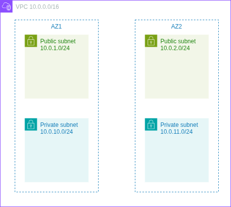
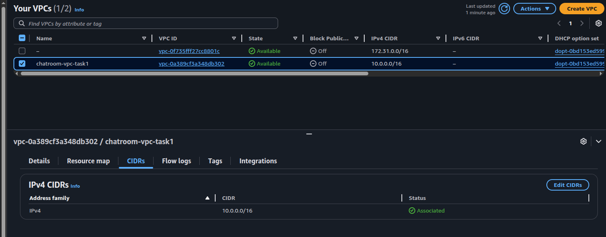
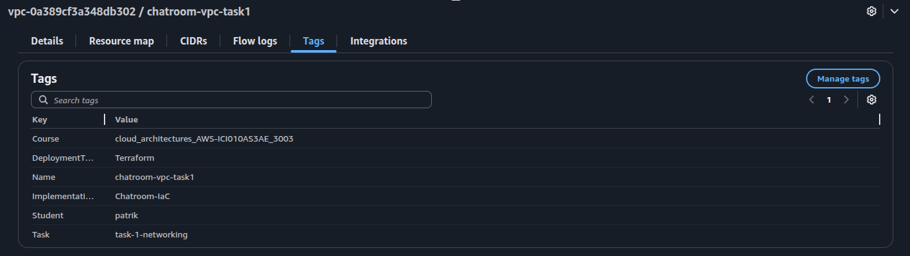
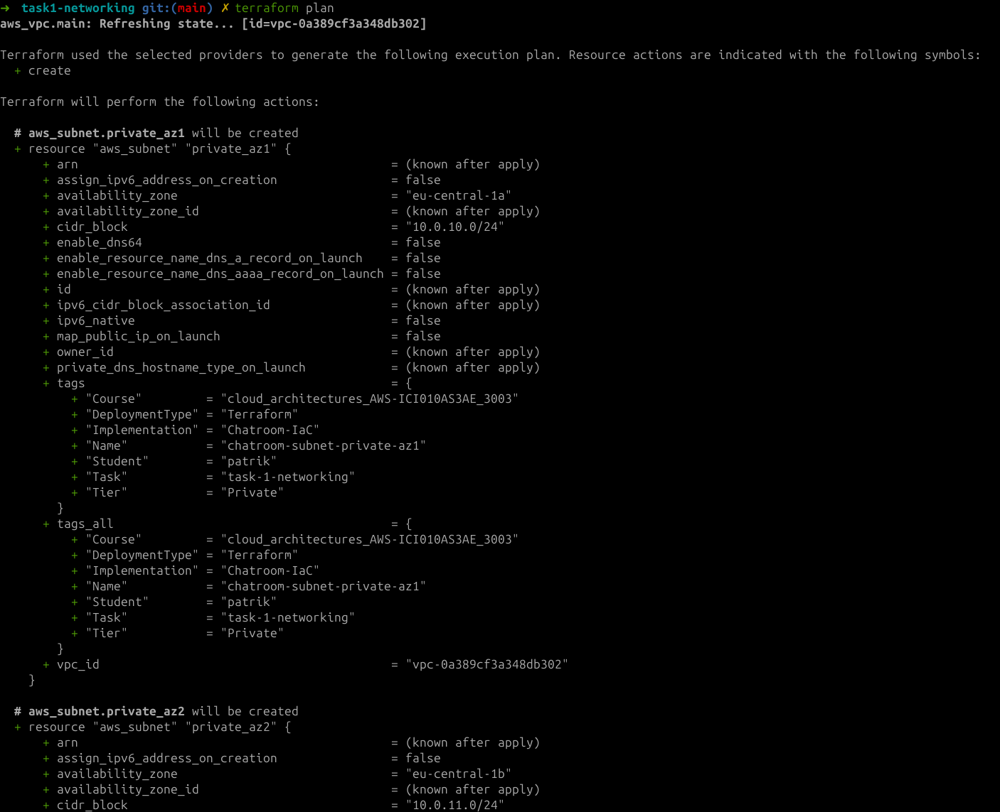
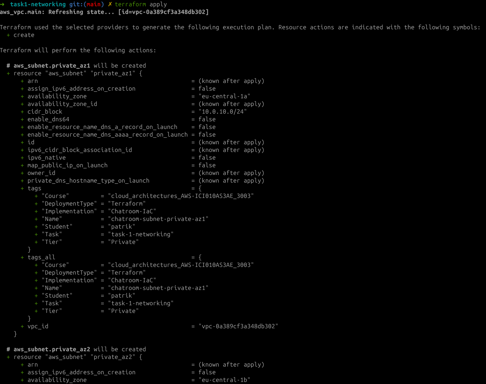
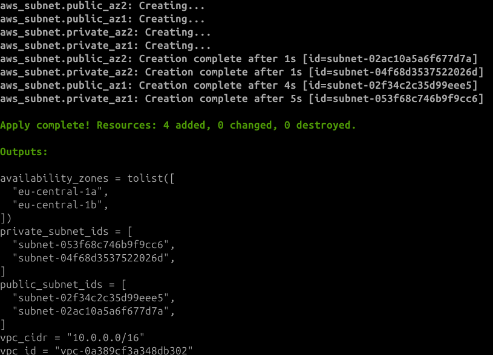
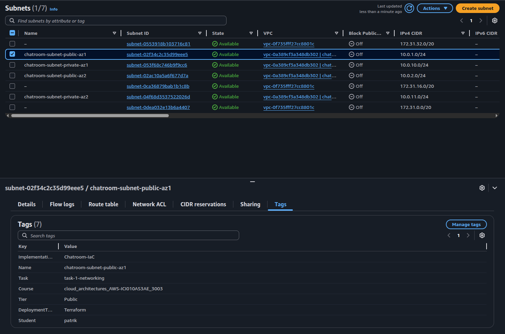
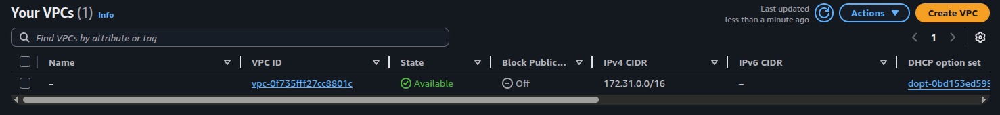

# Cloud Architectures AWS - Task 1 Networking
Task:
> Tag all created Cloud Resources (Course, Implementation, Task, Student, Deployment Type)

> README.md contains instructions how to deploy IaC templating.

> Task goals:

> - Decide resource naming convention
> - Decide IP segmentation
> - Virtual Network
> - Public Subnet AZ1
> - Public Subnet AZ2
> - Private Subnet AZ1
> - Private Subnet AZ2

(it will also contain my own documentative process of going through the task)

## First attempt at deploying via TF for this course
Let's try simple VPC deployment. Here I have already SSO'd in to AWS CLI, now with
profile `cloud-architect-task1`. After `main.tf` is written, I had to run `terraform init`
to initialize terraform to use the SSO + profile correctly. Only after this, running
`terraform plan` was possible.

Here's a small draw.io picture of what should be accomplished in the task.



These `main` and `variables` should stay somewhat constant throughout the task.

```bash
➜ cat main.tf
terraform {
  required_providers {
    aws = {
      source  = "hashicorp/aws"
      version = "~> 5.92"
    }
  }
  required_version = ">= 1.2.0"
}

provider "aws" {
  region  = var.region
  profile = "cloud-architect-task1"
}

locals {
  common_tags = {
    Course         = "cloud_architectures_AWS-ICI010AS3AE_3003"
    Implementation = "Chatroom-IaC"
    Task           = "task-1-networking"
    Student        = "patrik"
    DeploymentType = "Terraform"
  }
}

➜ cat variables.tf
variable "region" {
  type    = string
  default = "eu-central-1"
}

variable "vpc_cidr" {
  type    = string
  default = "10.0.0.0/16"
}

variable "availability_zones" {
  type    = list(string)
  default = ["eu-central-1a", "eu-central-1b"]
}

variable "public_subnet_cidrs" {
  type    = list(string)
  default = ["10.0.1.0/24", "10.0.2.0/24"]
}

variable "private_subnet_cidrs" {
  type    = list(string)
  default = ["10.0.10.0/24", "10.0.11.0/24"]
}
```

Next the `vpc.tf` and `terraform plan` output.

Just showing contents of these files as they won't be as they were here after completion.

```bash
➜ cat vpc.tf
resource "aws_vpc" "main" {
  cidr_block           = var.vpc_cidr
  enable_dns_hostnames = true
  enable_dns_support   = true
  tags = merge(local.common_tags, {
    Name = "chatroom-vpc-task1"
  })
}

➜ terraform plan

Terraform used the selected providers to generate the following execution plan. Resource actions are indicated with the following symbols:
  + create

Terraform will perform the following actions:

  # aws_vpc.main will be created
  + resource "aws_vpc" "main" {
      + arn                                  = (known after apply)
      + cidr_block                           = "10.0.0.0/16"
      + default_network_acl_id               = (known after apply)
      + default_route_table_id               = (known after apply)
      + default_security_group_id            = (known after apply)
      + dhcp_options_id                      = (known after apply)
      + enable_dns_hostnames                 = true
      + enable_dns_support                   = true
      + enable_network_address_usage_metrics = (known after apply)
      + id                                   = (known after apply)
      + instance_tenancy                     = "default"
      + ipv6_association_id                  = (known after apply)
      + ipv6_cidr_block                      = (known after apply)
      + ipv6_cidr_block_network_border_group = (known after apply)
      + main_route_table_id                  = (known after apply)
      + owner_id                             = (known after apply)
      + tags                                 = {
          + "Course"         = "cloud_architectures_AWS-ICI010AS3AE_3003"
          + "DeploymentType" = "Terraform"
          + "Implementation" = "Chatroom-IaC"
          + "Name"           = "chatroom-vpc-task1"
          + "Student"        = "patrik"
          + "Task"           = "task-1-networking"
        }
      + tags_all                             = {
          + "Course"         = "cloud_architectures_AWS-ICI010AS3AE_3003"
          + "DeploymentType" = "Terraform"
          + "Implementation" = "Chatroom-IaC"
          + "Name"           = "chatroom-vpc-task1"
          + "Student"        = "patrik"
          + "Task"           = "task-1-networking"
        }
    }

Plan: 1 to add, 0 to change, 0 to destroy.

─────────────────────────────────────────────────────────────────────────────────────────────────────────────────────────────────────────────────────────────────────────

Note: You didn't use the -out option to save this plan, so Terraform can't guarantee to take exactly these actions if you run "terraform apply" now.
```

And then deploying:

```bash
➜ terraform apply

Terraform used the selected providers to generate the following execution plan. Resource actions are indicated with the following symbols:
  + create

Terraform will perform the following actions:

  # aws_vpc.main will be created
  + resource "aws_vpc" "main" {
      + arn                                  = (known after apply)
      + cidr_block                           = "10.0.0.0/16"
      + default_network_acl_id               = (known after apply)
      + default_route_table_id               = (known after apply)
      + default_security_group_id            = (known after apply)
      + dhcp_options_id                      = (known after apply)
      + enable_dns_hostnames                 = true
      + enable_dns_support                   = true
      + enable_network_address_usage_metrics = (known after apply)
      + id                                   = (known after apply)
      + instance_tenancy                     = "default"
      + ipv6_association_id                  = (known after apply)
      + ipv6_cidr_block                      = (known after apply)
      + ipv6_cidr_block_network_border_group = (known after apply)
      + main_route_table_id                  = (known after apply)
      + owner_id                             = (known after apply)
      + tags                                 = {
          + "Course"         = "cloud_architectures_AWS-ICI010AS3AE_3003"
          + "DeploymentType" = "Terraform"
          + "Implementation" = "Chatroom-IaC"
          + "Name"           = "chatroom-vpc-task1"
          + "Student"        = "patrik"
          + "Task"           = "task-1-networking"
        }
      + tags_all                             = {
          + "Course"         = "cloud_architectures_AWS-ICI010AS3AE_3003"
          + "DeploymentType" = "Terraform"
          + "Implementation" = "Chatroom-IaC"
          + "Name"           = "chatroom-vpc-task1"
          + "Student"        = "patrik"
          + "Task"           = "task-1-networking"
        }
    }

Plan: 1 to add, 0 to change, 0 to destroy.

Do you want to perform these actions?
  Terraform will perform the actions described above.
  Only 'yes' will be accepted to approve.

  Enter a value: yes

aws_vpc.main: Creating...
aws_vpc.main: Still creating... [00m10s elapsed]
aws_vpc.main: Creation complete after 12s [id=vpc-0a389cf3a348db302]

Apply complete! Resources: 1 added, 0 changed, 0 destroyed.
```

Here's images from the AWS console showcasing something has happened.



Also took image of the tag page for the chatroom-vpc-task1.



I noticed at this point we should also have an `outputs.tf`, that
will for example output the newly created VPC ID. I created the file after the
previous apply, but apparently I can run `terraform refresh` to refresh the tf
state file, which would otherwise hold the necessary output.

```bash
➜ cat outputs.tf
output "vpc_id" {
  value = aws_vpc.main.id
}
➜ terraform refresh
aws_vpc.main: Refreshing state... [id=vpc-0a389cf3a348db302]

Outputs:

vpc_id = "vpc-0a389cf3a348db302"
➜ terraform output
vpc_id = "vpc-0a389cf3a348db302"
```

## Actual deployment according to task 1

Seems everything is working fine, now we can work on finishing rest of the task
requirements. We need to add 2 public and 2 private subnets

The VPC setup is completely fine for this task from the previous part, so we can
now build on top of the `vpc.tf` by finishing all the other stuff too.

And then adding a subnet to a particular AZ:
```terraform
resource "aws_subnet" "public_az1" {
  vpc_id                  = aws_vpc.main.id
  cidr_block              = var.public_subnet_cidrs[0]
  availability_zone       = var.availability_zones[0]

  tags = merge(local.common_tags, {
    Name = "chatroom-subnet-public-az1"
    Tier = "Public"
  })
}
```

Rest of the subnets can be added by copy-pasting, changing az1 -> az2 when needed
and public -> private when needed. Taking care of the `cidr_block` and `availability_zone`
to be as expected in `variables.tf`.

I found that public subnets are typically given `map_public_ip_on_launch` as `true`,
but since for this task it's not necessary yet to prove connectivity, we can leave it
for task 2. Private subnets don't need the `map_public_ip_on_launch` setting.
Also this setting will provision a normal public IP, not elastic one.
But non-elastic is now the more cost efficient choice here as it's not required to have
a static IP that lasts through starts and stops of instances.

Running `terraform plan` now outputs part as shown in image. This text would be
too heavy to read in text, so simply an image of the output it given now for proof
it ran and output something.



Then running apply:



outputs of apply:



And outputs as text as well to help with readability
```bash
...
Apply complete! Resources: 4 added, 0 changed, 0 destroyed.

Outputs:

availability_zones = tolist([
  "eu-central-1a",
  "eu-central-1b",
])
private_subnet_ids = [
  "subnet-053f68c746b9f9cc6",
  "subnet-04f68d3537522026d",
]
public_subnet_ids = [
  "subnet-02f34c2c35d99eee5",
  "subnet-02ac10a5a6f677d7a",
]
vpc_cidr = "10.0.0.0/16"
vpc_id = "vpc-0a389cf3a348db302"
```

Finally, image from AWS console, showcasing all subnets, selected public-az1 to
also show tags.



Then finally destroying everything:

```bash
➜ terraform destroy
Do you really want to destroy all resources?
  Terraform will destroy all your managed infrastructure, as shown above.
  There is no undo. Only 'yes' will be accepted to confirm.

  Enter a value: yes

aws_subnet.private_az1: Destroying... [id=subnet-053f68c746b9f9cc6]
aws_subnet.public_az1: Destroying... [id=subnet-02f34c2c35d99eee5]
aws_subnet.private_az2: Destroying... [id=subnet-04f68d3537522026d]
aws_subnet.public_az2: Destroying... [id=subnet-02ac10a5a6f677d7a]
aws_subnet.private_az1: Destruction complete after 1s
aws_subnet.private_az2: Destruction complete after 1s
aws_subnet.public_az2: Destruction complete after 1s
aws_subnet.public_az1: Destruction complete after 1s
aws_vpc.main: Destroying... [id=vpc-0a389cf3a348db302]
aws_vpc.main: Destruction complete after 1s

Destroy complete! Resources: 5 destroyed.
```

And image of the VPC part in AWS console. Only default VPC left.



## So, everything that was required from start to finish
- Need access to AWS through AWS CLI. Need also proper permissions.
    - Perms here outlined in `TaskNetworkingPolicy.json`
    - I used IAM Identity Center. I already had a user here that is used for
    testing the AWS CLI. I attach the policy to that user, then use the AWS
    CLI for SSO'ing into that user
        - `aws configure sso` -> login, give access to CLI
        - creating a user might be a hassle, might not..
- Once AWS CLI works, make sure `main.tf` is populated (take care of the profile
being correct! It's name is set during SSO), run `terraform init`.
- If init worked. Next run `terraform plan` to see what will be done.
    - Assuming all tf files from my repository is in that directory, the plan
    should show somewhat similar stuff as seen here in the report.
- If happy with the plan, run `terraform apply`.
- Confirm in AWS console

## fast notes here while working
- IAM identity center > permission sets > new permission set > inline policy
- copy paste TaskNetworkingPolicy.json
- tag: cloud_architectures_AWS-ICI010AS3AE_3003-task1-patrik-permission_set
- to update permission set
    - AWS accounts > users and groups > select user > change permission sets
- https://developer.hashicorp.com/terraform/tutorials/aws-get-started/aws-create
- for `vpc.tf`: https://registry.terraform.io/modules/terraform-aws-modules/vpc/aws/latest

