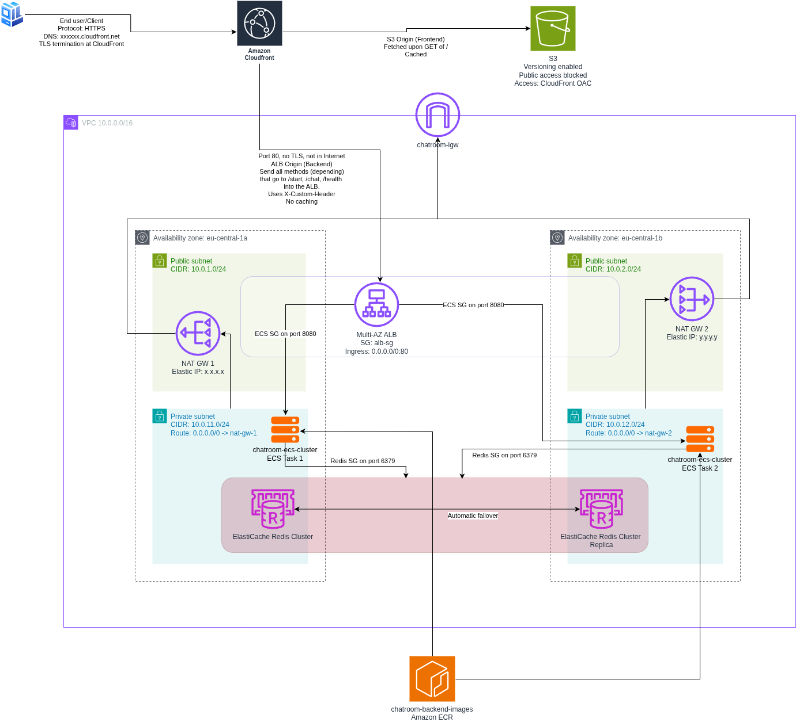
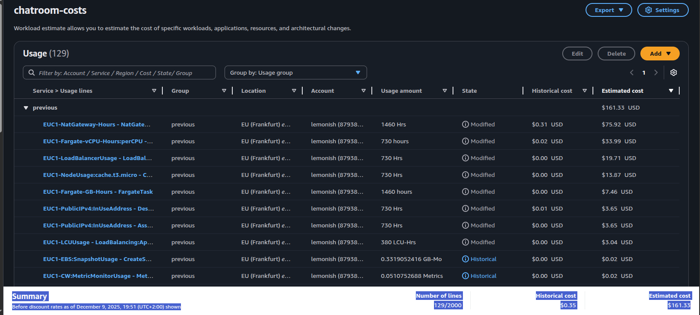

# Cloud Architectures AWS - Task 10: Draw and Annotate Architecture Task and Estimate Costs Task

Task:
> - Draw solution architecture diagram about your deployment.
> - Diagram must be complete as possible as if it was for production usage.
> - Note that your actual IaC deployment does not need to be production ready (no custom Domain etc.).
> - Include as annotations all DNS, IP, TLS, Port and other critical details.
> - Use diagram tool like: draw.io, Lucidchart, etc.
> - Use AWS/Azure calculator to estimate costs.

(Source: https://pekkakorpi-tassi.fi/courses/pkt-arc/pkt-arc-edu-olt-2025-1e/iac_deployment.html)

This documentation will also contain my own documentative process of going through the task

## Task 10 implementation

### Solution architecture diagram

### Cost estimation
I used AWS Pricing calculator for this. It worked by creating a new estimate,
then adding estimates by historical usage, Add -> Historical usage from my accounts.

I added everything, then went through all services that had hours in them, edited
them manually, changed to usage amount to a base of 730 hours per month, then did
some multiplication based on how many resources are in use for my deployment. For
example since I have 2 NAT gateways, the total usage time for NAT gateway would
be 2 * 730 = 1460 hours per month.

As can be seen, the cost estimate per month is around $161.33. Largest savings
to be had would be to drop from two NAT gateways to one. This change would mean
that the private instance in the second AZ would need to route it's traffic through
the first AZ. This will incur it's own costs, but up to a certain point, it would
be cheaper to do it this way.

ECS and Fargate costs are estimated from having 2 tasks (0.5vCPU + 1GB RAM each)
up 24/7.
