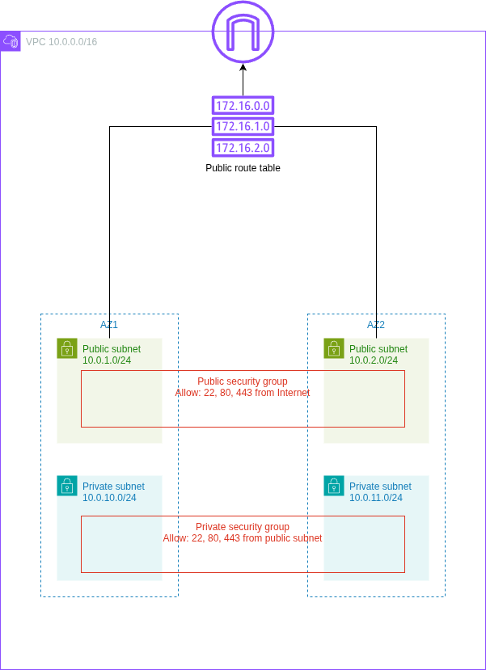
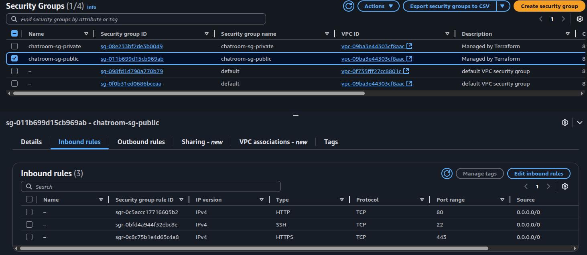
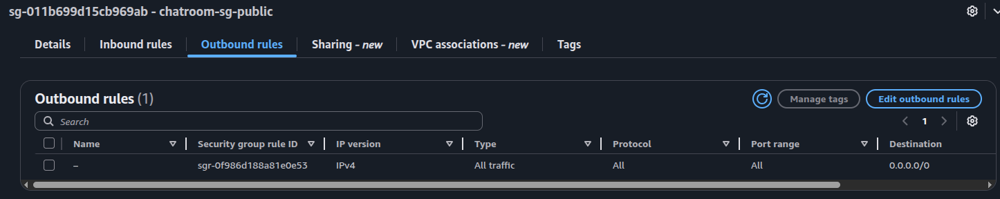
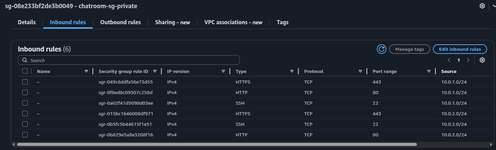
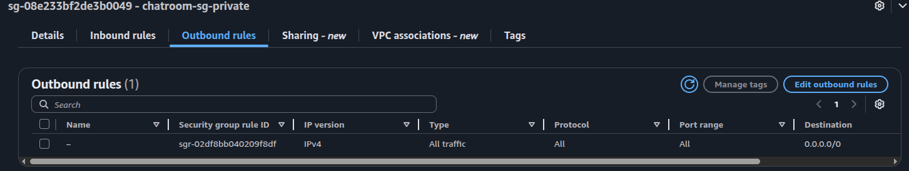

# Cloud Architectures AWS - Task 2 Firewall
Task:
> Aim is to take IaC template (or templates) from previous task and expand the configurations.

> Aim is to continue to develop IaC template (or templates) that handles the requirements of this task.

> Setup IaC templating to be parameterized with defaults.

> README.md contains instructions how to deploy IaC templating.

> Task goals:

> - Public Subnet firewall: allow 22, 80, 443 from the Internet
> - Private Subnet firewall: allow 22, 80, 443 from Public Subnet

(Source: https://pekkakorpi-tassi.fi/courses/pkt-arc/pkt-arc-edu-olt-2025-1e/iac_deployment.html)

This documentation will also contain my own documentative process of going through the task

## Task 2 implementation
Let's take a copy of the task 1 directory for a baseline, then build onto that.

Image of the goal infrastructure:



Update `main.tf` to the new task:

```bash
➜ diff main.tf ../task1-networking/main.tf
13c13
<   profile = "cloud-architect-task2"
---
>   profile = "cloud-architect-task1"
20c20
<     Task           = "task-2-firewall"
---
>     Task           = "task-1-networking"
```

The VPC setup is completely fine for this task from the previous part, so we can
now build on top of the `vpc.tf` by finishing all the other stuff too.

Adding internet gateway:

```terraform
resource "aws_internet_gateway" "main" {
  vpc_id = aws_vpc.main.id

  tags = merge(local.common_tags, {
    Name = "chatroom-igw"
  })
}
```

Adding public route table and route:
```terraform
resource "aws_route_table" "public" {
  vpc_id = aws_vpc.main.id

  tags = merge(local.common_tags, {
    Name = "chatroom-rt-public"
  })
}

resource "aws_route" "public_internet" {
  route_table_id         = aws_route_table.public.id
  destination_cidr_block = "0.0.0.0/0"
  gateway_id             = aws_internet_gateway.main.id
}
```

Adding associations to public subnets:
```terraform
resource "aws_route_table_association" "public_az1" {
  subnet_id      = aws_subnet.public_az1.id
  route_table_id = aws_route_table.public.id
}

resource "aws_route_table_association" "public_az2" {
  subnet_id      = aws_subnet.public_az2.id
  route_table_id = aws_route_table.public.id
}
```

Now giving public subnets `map_public_ip_on_launch` as `true` so they have public
internet connectivity. Example:

```terraform
resource "aws_subnet" "public_az1" {
  vpc_id                  = aws_vpc.main.id
  cidr_block              = var.public_subnet_cidrs[0]
  availability_zone       = var.availability_zones[0]
  map_public_ip_on_launch = true

  tags = merge(local.common_tags, {
    Name = "chatroom-subnet-public-az1"
    Tier = "Public"
  })
}
```

Adding the security groups. For example the public one:
```terraform
resource "aws_security_group" "public" {
  name   = "chatroom-sg-public"
  vpc_id = aws_vpc.main.id

  ingress {
    description = "SSH from anywhere"
    from_port   = 22
    to_port     = 22
    protocol    = "tcp"
    cidr_blocks = ["0.0.0.0/0"]
  }

  ingress {
    description = "HTTP from anywhere"
    from_port   = 80
    to_port     = 80
    protocol    = "tcp"
    cidr_blocks = ["0.0.0.0/0"]
  }

  ingress {
    description = "HTTPS from anywhere"
    from_port   = 443
    to_port     = 443
    protocol    = "tcp"
    cidr_blocks = ["0.0.0.0/0"]
  }

  egress {
    description = "Allow all outbound"
    from_port   = 0
    to_port     = 0
    protocol    = "-1"
    cidr_blocks = ["0.0.0.0/0"]
  }

  tags = merge(local.common_tags, {
    Name = "chatroom-sg-public"
    Tier = "Public"
  })
}
```

And same can be copy pasted for private, replacing public -> private, then
also cidr_blocks -> public subnet.

Update `outputs.tf` based on new configs:

```bash
➜ diff outputs.tf ../task1-networking/outputs.tf
20,35d19
<
< output "internet_gateway_id" {
<   value = aws_internet_gateway.main.id
< }
<
< output "public_route_table_id" {
<   value = aws_route_table.public.id
< }
<
< output "public_security_group_id" {
<   value = aws_security_group.public.id
< }
<
< output "private_security_group_id" {
<   value = aws_security_group.private.id
< }
```

Next, setting up the AWS CLI, SSO, initializing terraform, testing the deployment:
```bash
➜ aws configure sso
# typical login flow, set profile as cloud-architect-task2

➜ terraform init
...
Terraform has been successfully initialized!

➜ terraform plan
# read through the plan and make sure everything looks right!!

➜ terraform apply
...
aws_vpc.main: Creating...
aws_vpc.main: Still creating... [00m10s elapsed]
aws_vpc.main: Creation complete after 11s [id=vpc-09ba3e44303cf8aac]
aws_internet_gateway.main: Creating...
aws_subnet.public_az2: Creating...
aws_route_table.public: Creating...
aws_subnet.public_az1: Creating...
aws_subnet.private_az2: Creating...
aws_subnet.private_az1: Creating...
aws_security_group.public: Creating...
aws_security_group.private: Creating...
aws_internet_gateway.main: Creation complete after 1s [id=igw-065b5ea590ca79d76]
aws_route_table.public: Creation complete after 1s [id=rtb-01aa0237aa17d4c35]
aws_route.public_internet: Creating...
aws_subnet.private_az2: Creation complete after 1s [id=subnet-0d3d76e98240975ec]
aws_route.public_internet: Creation complete after 1s [id=r-rtb-01aa0237aa17d4c351080289494]
aws_security_group.public: Creation complete after 3s [id=sg-011b699d15cb969ab]
aws_security_group.private: Creation complete after 3s [id=sg-08e233bf2de3b0049]
aws_subnet.private_az1: Creation complete after 4s [id=subnet-0879a212feafbd2b3]
aws_subnet.public_az2: Still creating... [00m10s elapsed]
aws_subnet.public_az1: Still creating... [00m10s elapsed]
aws_subnet.public_az2: Creation complete after 12s [id=subnet-0e1d4ac6076e85340]
aws_route_table_association.public_az2: Creating...
aws_subnet.public_az1: Creation complete after 12s [id=subnet-0e1a634970cca381d]
aws_route_table_association.public_az1: Creating...
aws_route_table_association.public_az2: Creation complete after 0s [id=rtbassoc-09f30203b848b81e9]
aws_route_table_association.public_az1: Creation complete after 0s [id=rtbassoc-07211ea1e725626b2]

Apply complete! Resources: 12 added, 0 changed, 0 destroyed.

Outputs:

availability_zones = tolist([
  "eu-central-1a",
  "eu-central-1b",
])
internet_gateway_id = "igw-065b5ea590ca79d76"
private_security_group_id = "sg-08e233bf2de3b0049"
private_subnet_ids = [
  "subnet-0879a212feafbd2b3",
  "subnet-0d3d76e98240975ec",
]
public_route_table_id = "rtb-01aa0237aa17d4c35"
public_security_group_id = "sg-011b699d15cb969ab"
public_subnet_ids = [
  "subnet-0e1a634970cca381d",
  "subnet-0e1d4ac6076e85340",
]
vpc_cidr = "10.0.0.0/16"
vpc_id = "vpc-09ba3e44303cf8aac"
```

Let's check in the console:

It's visible that security groups at least were created as expected.

All SG's and inbound of public-sg:



Outbound of public-sg:



Inbound of private-sg:



Outbound of private-sg:



## Requirements for deployment
- Need access to AWS through AWS CLI. Need also proper permissions.
    - Perms here outlined in `cloud_architect_course_policies.json`
    - I used IAM Identity Center. I already had a user here that is used for
    testing the AWS CLI. I attach the policy to that user, then use the AWS
    CLI for SSO'ing into that user
        - `aws configure sso` -> login, give access to CLI
        - creating a user might be a hassle, might not..
        - NOTE: difference compared to task 1 is that I now have a general permission
        set "cloud_architect_course_policies" that I will just update for each
        task instead of creating new permission sets for each task.
- Once AWS CLI works, make sure `main.tf` is populated (take care of the profile
being correct! It's name is set during SSO), run `terraform init`.
- If init worked. Next run `terraform plan` to see what will be done.
    - Assuming all tf files from my repository is in that directory, the plan
    should show somewhat similar stuff as seen here in the report.
- If happy with the plan, run `terraform apply`.
- Confirm in AWS console

## These are good for multiple tasks when updating permission policies
- to update permission set
    - IAM Identity Center > Permission sets > cloud_architect_course_policies
        - edit inline policy
    - new permission set for user
        - AWS accounts > users and groups > select user > change permission sets
