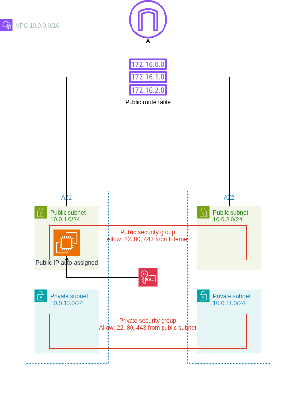
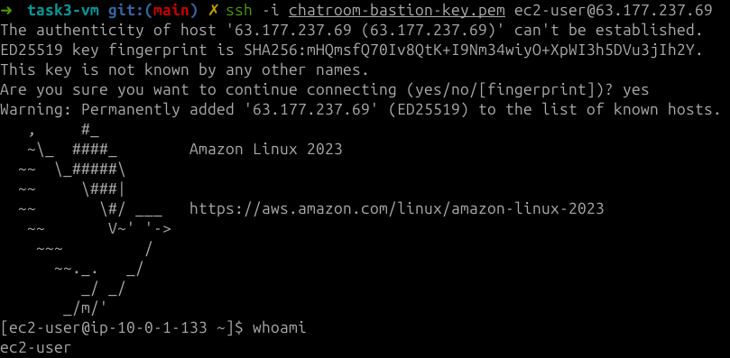
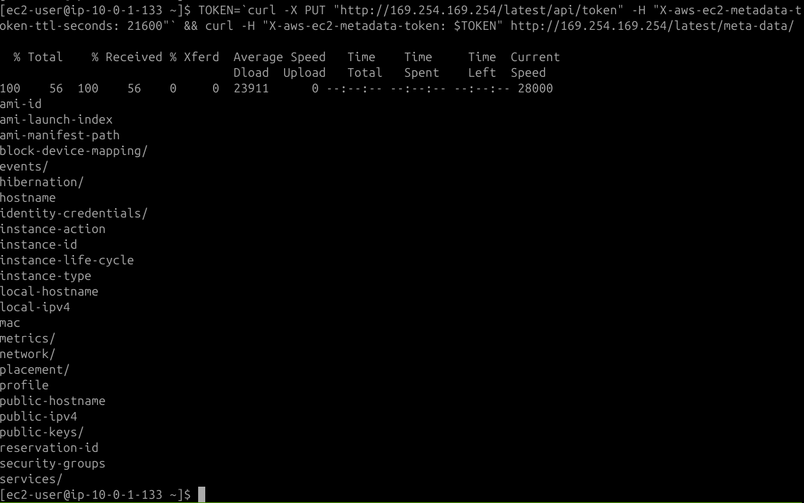
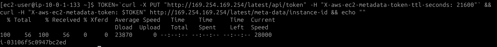
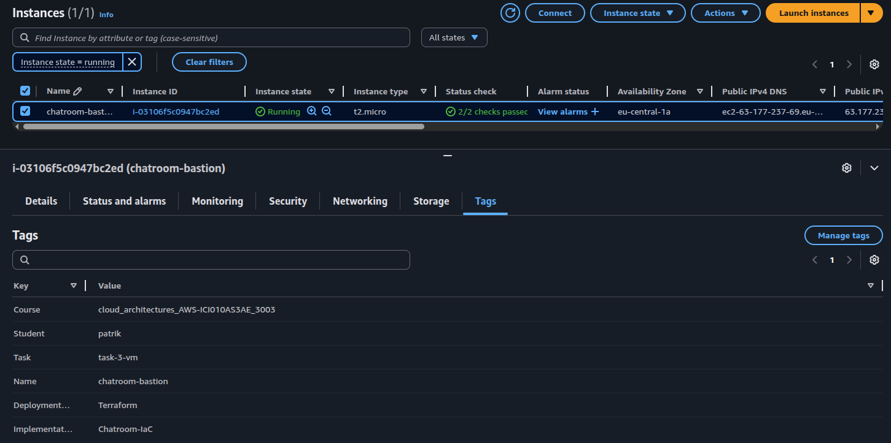

# Cloud Architectures AWS - Task 3 VM
Task:
> Aim is to take IaC template (or templates) from previous task and expand the configurations.

> Aim is to continue to develop IaC template (or templates) that handles the requirements of this task.

> Setup IaC templating to be parameterized with defaults.

> README.md contains instructions how to deploy IaC templating.

> Task goals:

> - Create Key Pair
> - Create Linux VM
> - Launch Linux VM to Public Subnet (requires Public IP Address)
> - Tag Created Resources (Course, Implementation, Task, Student, Deployment Type)
> - SSH to VM
> - Read VM metadata with curl on VM and inlude screenshot to task README.txt

(Source: https://pekkakorpi-tassi.fi/courses/pkt-arc/pkt-arc-edu-olt-2025-1e/iac_deployment.html)

This documentation will also contain my own documentative process of going through the task

## Task 3 implementation

### Preparing policies
We need to update CRUD access for this task. New policies should include ability
to handle adding a key pair and creating a Linux VM. So it's time to define a new
`KeyPairAndInstanceCrud` statement.

```json
    {
      "Sid": "KeyPairAndInstanceCrud",
      "Effect": "Allow",
      "Action": [
        "ec2:CreateKeyPair",
        "ec2:DeleteKeyPair",
        "ec2:ImportKeyPair",
        "ec2:TerminateInstances",
        "ec2:StartInstances",
        "ec2:StopInstances",
        "ec2:RebootInstances"
      ],
      "Resource": "*"
    }
```

Also, for safety, one can set the `RunInstances` policy to be allowed only for
size `t2.micro` for example:

```json
    {
      "Sid": "AllowOnlyT2Micro",
      "Effect": "Allow",
      "Action": "ec2:RunInstances",
      "Resource": "*",
      "Condition": {
        "StringEquals": {
          "ec2:InstanceType": "t2.micro"
        }
      }
    }
```

NOTE: It's also important to define RunInstances to other resources without the
condition. More information [here](https://docs.aws.amazon.com/AWSEC2/latest/UserGuide/ExamplePolicies_EC2.html#iam-example-runinstances)
at the "Instance types" part. Thus adding the following part to policy too:

```json
    {
      "Sid": "AllowRunInstancesOtherResources",
      "Effect": "Allow",
      "Action": "ec2:RunInstances",
      "Resource": [
        "arn:aws:ec2:*::image/ami-*",
        "arn:aws:ec2:*:*:subnet/*",
        "arn:aws:ec2:*:*:network-interface/*",
        "arn:aws:ec2:*:*:volume/*",
        "arn:aws:ec2:*:*:key-pair/*",
        "arn:aws:ec2:*:*:security-group/*"
      ]
    }
```

### Changes to Terraform configs
Updated `main.tf` similarly as previous task, so changing task 2 -> 3 basically.

Image of the goal infrastructure:



I noticed that the `vpc.tf` is getting bloated. I separated security groups into
their own `sg.tf` config file to fix that.

Created a new `ec2.tf` for handling virtual machines and private key for SSH.

Used this for help in SSH keys: https://registry.terraform.io/providers/hashicorp/tls/latest/docs/resources/private_key

Explanation for `local_file`'s filename `path.module` can be found [here](https://developer.hashicorp.com/terraform/language/expressions/references#filesystem-and-workspace-info).
It's the filesystem path of the module where the expression is placed in.

```terraform
resource "tls_private_key" "bastion" {
  algorithm = "RSA"
  rsa_bits  = 4096
}

resource "aws_key_pair" "bastion" {
  key_name   = var.ssh_key_name
  public_key = tls_private_key.bastion.public_key_openssh
  tags = merge(local.common_tags, {
    Name = var.ssh_key_name
  })
}

resource "local_file" "private_key" {
  content         = tls_private_key.bastion.private_key_pem
  filename        = "${path.module}/${var.ssh_key_name}.pem"
  file_permission = 0400
}
```

And then the ec2-part of `ec2.tf`. The first thing to do is to find the AMI name
that should be put to the deployed instance.

I went to AWS console > EC2 > AMI catalog. Here I searched for AMIs by using "Free tier only",
"All Linux/Unix", "64-bit (x86)" ticks. Then choosing the Amazon Linux AMI with
highest kernel version. I copied the AMI ID, then used the CLI to determine what
this AMI name is:

```bash
➜ aws ec2 describe-images --image-ids ami-0013b4404496ef718 --query "Images[0].Name"
"al2023-ami-2023.9.20251110.1-kernel-6.12-x86_64"
```
(Source: https://aws.amazon.com/blogs/compute/query-for-the-latest-amazon-linux-ami-ids-using-aws-systems-manager-parameter-store/)

And to be less specific, the part between "ami" and "kernel" can be wildcarded,
while using the term `most_recent` in the terraform config for AMI declaration
to make sure we can always get the most recent version of this specific AMI.

```terraform
data "aws_ami" "amazon_linux" {
  most_recent = true
  owners      = ["amazon"]
  filter {
    name   = "name"
    values = ["al2023-ami-*-kernel-6.12-x86_64"]
  }
  filter {
    name   = "virtualization-type"
    values = ["hvm"]
  }
}
```

And the Linux VM:

```terraform
resource "aws_instance" "bastion" {
  ami                         = data.aws_ami.amazon_linux.id
  instance_type               = var.instance_type
  subnet_id                   = aws_subnet.public_az1.id
  vpc_security_group_ids      = [aws_security_group.public.id]
  key_name                    = aws_key_pair.bastion.key_name
  associate_public_ip_address = true
  tags = merge(local.common_tags, {
    Name = "chatroom-bastion"
  })
}
```

Update `outputs.tf` based on new configs:

```bash
➜ diff outputs.tf ../task2-firewall/outputs.tf
36,67d35
<
< output "bastion_instance_id" {
<   value = aws_instance.bastion.id
< }
<
< output "bastion_public_ip" {
<   value = aws_instance.bastion.public_ip
< }
<
< output "bastion_private_ip" {
<   value = aws_instance.bastion.private_ip
< }
<
< output "ssh_key_name" {
<   value = aws_key_pair.bastion.key_name
< }
<
< output "ssh_private_key_path" {
<   value = "${path.module}/${var.ssh_key_name}.pem"
< }
<
< output "ssh_command" {
<   value = "ssh -i ${var.ssh_key_name}.pem ec2-user@${aws_instance.bastion.public_ip}"
< }
<
< output "ami_id" {
<   value = data.aws_ami.amazon_linux.id
< }
<
< output "ami_name" {
<   value = data.aws_ami.amazon_linux.name
< }
```

Next, setting up the AWS CLI, SSO, initializing terraform, testing the deployment:
```bash
➜ aws configure sso
# typical login flow, set profile as cloud-architect-task3

➜ terraform init
...
Terraform has been successfully initialized!

➜ terraform plan
# read through the plan and make sure everything looks right!!

➜ terraform apply
...
Apply complete! Resources: 16 added, 0 changed, 0 destroyed.

Outputs:
ami_id = "ami-0e6304d9080b0d13d"
ami_name = "al2023-ami-minimal-2023.9.20251110.1-kernel-6.12-x86_64"
availability_zones = tolist([
  "eu-central-1a",
  "eu-central-1b",
])
bastion_instance_id = "i-03106f5c0947bc2ed"
bastion_private_ip = "10.0.1.133"
bastion_public_ip = "63.177.237.69"
internet_gateway_id = "igw-0c6c1f2bd212a1c44"
private_security_group_id = "sg-0c4e8074ee08797b5"
private_subnet_ids = [
  "subnet-067a17cb32bcaf8fe",
  "subnet-0b6e77e20b768104c",
]
public_route_table_id = "rtb-0e48c16d1b1ea7dbc"
public_security_group_id = "sg-0d48eefd0a9917fd3"
public_subnet_ids = [
  "subnet-0d3bfc23482c78a17",
  "subnet-0c34b5fed97fe77e5",
]
ssh_command = "ssh -i chatroom-bastion-key.pem ec2-user@63.177.237.69"
ssh_key_name = "chatroom-bastion-key"
ssh_private_key_path = "./chatroom-bastion-key.pem"
vpc_cidr = "10.0.0.0/16"
vpc_id = "vpc-039db94a33ef49fc5"
```

Running the given `ssh`-command:



Found command for getting the meta-data of an instance. It seems to work with IMDSv2.
More information on this found [here](https://docs.aws.amazon.com/AWSEC2/latest/UserGuide/instancedata-data-retrieval.html).





2nd meta-data image shows the instance id seems to match with what we got as output.

Here is a copy-pastable version of the commands run in previous 2 images:
```bash
# get working API token
$ TOKEN=`curl -X PUT "http://169.254.169.254/latest/api/token" -H "X-aws-ec2-metadata-token-ttl-seconds: 21600"`

# first command to list all listable meta-data
$ curl -H "X-aws-ec2-metadata-token: $TOKEN" http://169.254.169.254/latest/meta-data/

# second command to list instance-id for example. Add echo "" to the end so that new line is created after instance-id, for readability.
$ curl -H "X-aws-ec2-metadata-token: $TOKEN" http://169.254.169.254/latest/meta-data/instance-id && echo ""
```

Let's check in the console:



## Requirements for deployment
- Need access to AWS through AWS CLI. Need also proper permissions.
    - Perms here outlined in `cloud_architect_course_policies.json`
    - I used IAM Identity Center. I already had a user here that is used for
    testing the AWS CLI. I attach the policy to that user, then use the AWS
    CLI for SSO'ing into that user
        - `aws configure sso` -> login, give access to CLI
        - creating a user might be a hassle, might not..
        - NOTE: difference compared to task 1 is that I now have a general permission
        set "cloud_architect_course_policies" that I will just update for each
        task instead of creating new permission sets for each task.
- Once AWS CLI works, make sure `main.tf` is populated (take care of the profile
being correct! It's name is set during SSO), run `terraform init`.
- If init worked. Next run `terraform plan` to see what will be done.
    - Assuming all tf files from my repository is in that directory, the plan
    should show somewhat similar stuff as seen here in the report.
- If happy with the plan, run `terraform apply`.
- Confirm in AWS console

## These are good for multiple tasks when updating permission policies
- to update permission set
    - IAM Identity Center > Permission sets > cloud_architect_course_policies
        - edit inline policy
    - new permission set for user
        - AWS accounts > users and groups > select user > change permission sets
