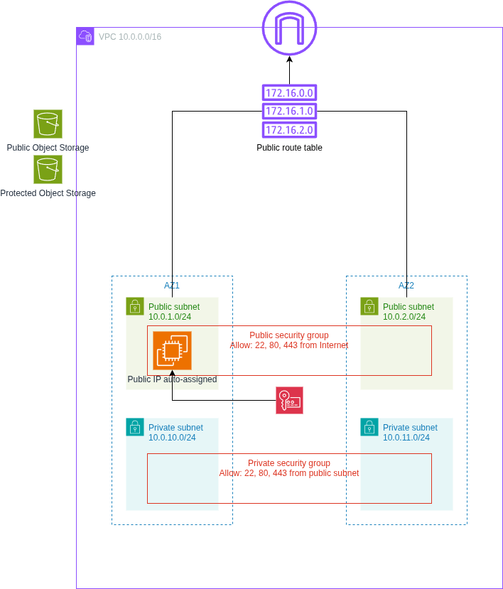
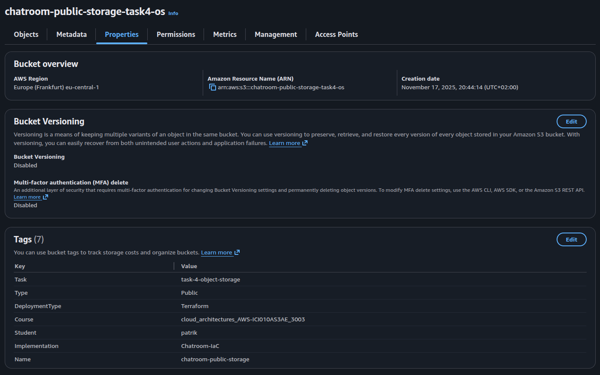
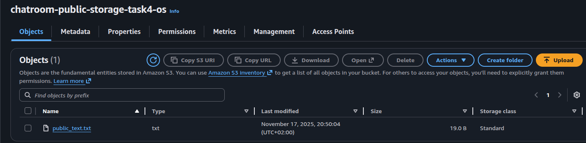
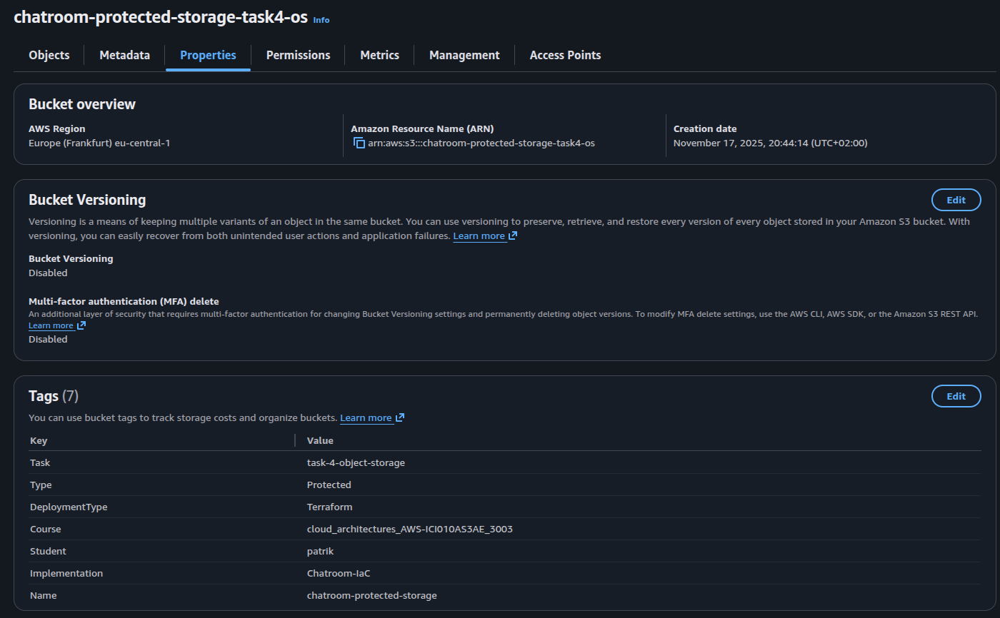
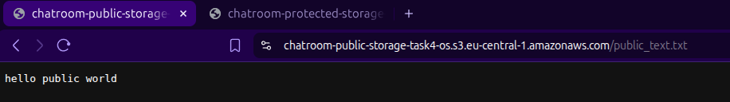
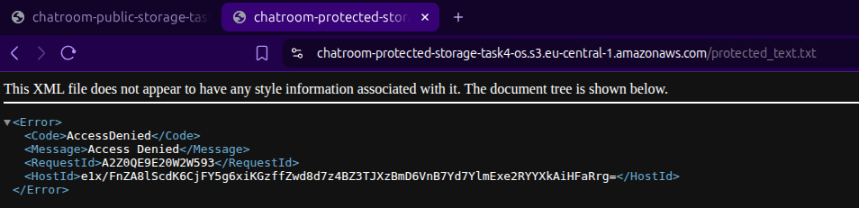
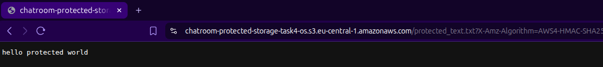

# Cloud Architectures AWS - Task 4 Object Storage
Task:
> Aim is to take IaC template (or templates) from previous task and expand the configurations.

> Aim is to continue to develop IaC template (or templates) that handles the requirements of this task.

> Setup IaC templating to be parameterized with defaults.

> README.md contains instructions how to deploy IaC templating.

> Task goals:

> - Create and configure Public Object Storage container
> - Create and configure Protected Object Storage container
> - Upload test files to Public container by using CLI
> - Upload test files to Protected container by using CLI
> - Include screenshots about Public and Protected containers with test files to task README.txt

(Source: https://pekkakorpi-tassi.fi/courses/pkt-arc/pkt-arc-edu-olt-2025-1e/iac_deployment.html)

This documentation will also contain my own documentative process of going through the task

## Task 4 implementation

### Preparing policies
I found a fun resource to see quickly what all kinds of actions can be given to
services, called [IAM Policy Simulator](https://policysim.aws.amazon.com/). I
used it here to see all the actions for S3 buckets, then I could simply work my
way backwards there to come up with this addition to my full policy json. Playing
with terraform in this task also showed me lots of policies for S3. The way TF
seems to play with S3 is much wider than initially I thought.

```json
    {
      "Sid": "S3GlobalBucketOperations",
      "Effect": "Allow",
      "Action": [
        "s3:CreateBucket",
        "s3:ListAllMyBuckets"
      ],
      "Resource": "*"
    },
    {
      "Sid": "S3BucketOperationsChatroom",
      "Effect": "Allow",
      "Action": [
        "s3:ListBucket",
        "s3:DeleteBucket",
        "s3:Get*",
        "s3:Put*",
        "s3:DeleteBucketPolicy"
      ],
      "Resource": "arn:aws:s3:::chatroom-*"
    },
    {
      "Sid": "S3ObjectOperationsChatroom",
      "Effect": "Allow",
      "Action": [
        "s3:PutObject*",
        "s3:GetObject*",
        "s3:DeleteObject*"
      ],
      "Resource": "arn:aws:s3:::chatroom-*/*"
    }
```

### Changes to Terraform configs
Updated `main.tf` similarly as previous task, so changing task 3 -> 4.

Image of the goal infrastructure:



Doesn't change much, as we're just adding S3 buckets, without doing anything with
them yet.

Adding a new `s3.tf` with following contents. Source: https://registry.terraform.io/providers/hashicorp/aws/latest/docs/resources/s3_bucket_acl

First defining both public and protected storage buckets with their tags.
```terraform
resource "aws_s3_bucket" "public_storage" {
  bucket = "chatroom-public-storage-task4-os"
  tags = merge(local.common_tags, {
    Name = "chatroom-public-storage",
    Type = "Public"
  })
}

resource "aws_s3_bucket" "protected_storage" {
  bucket = "chatroom-protected-storage-task4-os"
  tags = merge(local.common_tags, {
    Name = "chatroom-protected-storage",
    Type = "Protected"
  })
}
```

Then defining the public access block for the public bucket. Same does not have
to be done for the protected one as it's by default.
```terraform
resource "aws_s3_bucket_public_access_block" "public_storage" {
  bucket = aws_s3_bucket.public_storage.id

  block_public_acls       = false
  block_public_policy     = false
  ignore_public_acls      = false
  restrict_public_buckets = false
}
```

Then applying separate policy for the public storage so that anyone can get the
object.
```terraform
resource "aws_s3_bucket_policy" "public_storage" {
  bucket     = aws_s3_bucket.public_storage.id
  depends_on = [aws_s3_bucket_public_access_block.public_storage]

  policy = jsonencode({
    Version = "2012-10-17"
    Statement = [
      {
        Sid       = "PublicReadGetObject"
        Effect    = "Allow"
        Principal = "*"
        Action    = "s3:GetObject"
        Resource  = "${aws_s3_bucket.public_storage.arn}/*"
      }
    ]
  })
}
```

Update `outputs.tf` based on new configs. Just added public and protected bucket
ids to be shown.

```terraform
output "public_bucket_id" {
  value = aws_s3_bucket.public_storage.id
}

output "protected_bucket_id" {
  value = aws_s3_bucket.protected_storage.id
}
```

Next, setting up the AWS CLI, SSO, initializing terraform, testing the deployment:
```bash
➜ aws configure sso
# typical login flow, set profile as cloud-architect-task4

➜ terraform init
...
Terraform has been successfully initialized!

➜ terraform plan
# read through the plan and make sure everything looks right!!

➜ terraform apply
...
Apply complete! Resources: 20 added, 0 changed, 0 destroyed.

Outputs:

ami_id = "ami-0e6304d9080b0d13d"
ami_name = "al2023-ami-minimal-2023.9.20251110.1-kernel-6.12-x86_64"
availability_zones = tolist([
  "eu-central-1a",
  "eu-central-1b",
])
bastion_instance_id = "i-087634382838b0780"
bastion_private_ip = "10.0.1.224"
bastion_public_ip = "18.158.61.14"
internet_gateway_id = "igw-018828606fc49713f"
private_security_group_id = "sg-0ae5add3ddc9be44e"
private_subnet_ids = [
  "subnet-0d162cf02e4fb03c1",
  "subnet-0cb9e89eb09a9479f",
]
protected_bucket_id = "chatroom-protected-storage-task4-os"
public_bucket_id = "chatroom-public-storage-task4-os"
public_route_table_id = "rtb-06bae336d5b6bb1f4"
public_security_group_id = "sg-05ca7748ff43740b8"
public_subnet_ids = [
  "subnet-033e6273d4d7d8538",
  "subnet-033945d536692d1b0",
]
ssh_command = "ssh -i chatroom-bastion-key.pem ec2-user@18.158.61.14"
ssh_key_name = "chatroom-bastion-key"
ssh_private_key_path = "./chatroom-bastion-key.pem"
vpc_cidr = "10.0.0.0/16"
vpc_id = "vpc-045c5b3101c89368b"
```

Next, uploading to the buckets. I made two txt files `public_text.txt` and `protected_text.txt`.
Also need to make AWS_PROFILE as shown below, so the CLI has the necessary info.
```bash
➜ export AWS_PROFILE=cloud-architect-task4
➜ aws s3 cp public_text.txt s3://chatroom-public-storage-task4-os/
upload: ./public_text.txt to s3://chatroom-public-storage-task4-os/public_text.txt
➜ aws s3 cp protected_text.txt s3://chatroom-protected-storage-task4-os/
upload: ./protected_text.txt to s3://chatroom-protected-storage-task4-os/protected_text.txt
```

Images from the console and browser, showing tags too:

Image showing tags of public bucket:



Image showing object within public bucket:



Image showing tags of protected bucket:



Image showing object within protected bucket:


Testing the contents of public_text.txt from incognito with raw URL



Testing same for protected_text.txt



Testing protected_text.txt with cookie that shows it's me (get URL directly from
AWS console).



For cleanup, I had to delete the objects from buckets and then `terraform destroy`
as usual.

## Requirements for deployment
- Need access to AWS through AWS CLI. Need also proper permissions.
    - Perms here outlined in `cloud_architect_course_policies.json`
    - I used IAM Identity Center. I already had a user here that is used for
    testing the AWS CLI. I attach the policy to that user, then use the AWS
    CLI for SSO'ing into that user
        - `aws configure sso` -> login, give access to CLI
        - creating a user might be a hassle, might not..
        - NOTE: difference compared to task 1 is that I now have a general permission
        set "cloud_architect_course_policies" that I will just update for each
        task instead of creating new permission sets for each task.
- Once AWS CLI works, make sure `main.tf` is populated (take care of the profile
being correct! It's name is set during SSO), run `terraform init`.
- If init worked. Next run `terraform plan` to see what will be done.
    - Assuming all tf files from my repository is in that directory, the plan
    should show somewhat similar stuff as seen here in the report.
- If happy with the plan, run `terraform apply`.
- Confirm in AWS console

## These are good for multiple tasks when updating permission policies
- to update permission set
    - IAM Identity Center > Permission sets > cloud_architect_course_policies
        - edit inline policy
    - new permission set for user
        - AWS accounts > users and groups > select user > change permission sets
