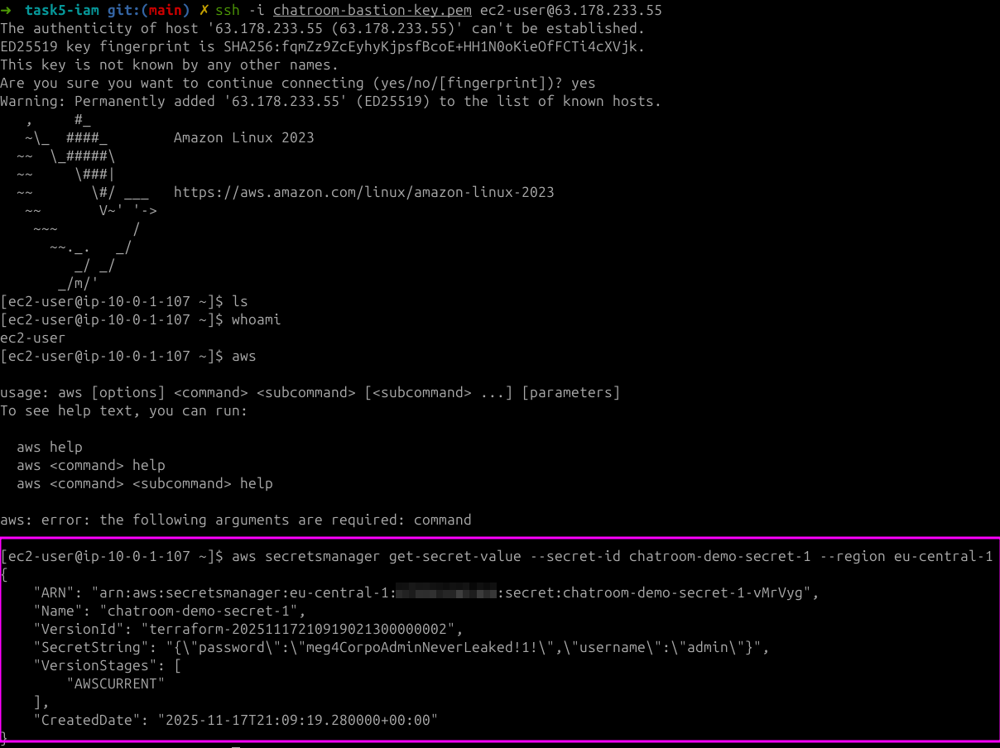

# Cloud Architectures AWS - Task 5 IAM
Task:
> Aim is to take IaC template (or templates) from previous task and expand the configurations.

> Aim is to continue to develop IaC template (or templates) that handles the requirements of this task.

> Setup IaC templating to be parameterized with defaults.

> README.md contains instructions how to deploy IaC templating.

> Task goals:
> - Create credential management managed service secret like dummy username + password
> - Create IAM/RBAC Permissions that allow to read secret
> - Attach Permissions to VM (through Role in AWS)
> - SSH to VM
> - Test Permissions by reading secret from cloud management CLI on VM and inlude screenshot to task README.txt

(Source: https://pekkakorpi-tassi.fi/courses/pkt-arc/pkt-arc-edu-olt-2025-1e/iac_deployment.html)

This documentation will also contain my own documentative process of going through the task

## Task 5 implementation

### Preparing policies
Need to at least give permissions for iam and secrets manager here. Honestly this
took quite a long time, as I tried again to look at policysim (same as previous task),
but had several actions that was missed, and had to be one by one added to the
policy after getting the terraform errors of them missing.

Most of these were found, but a couple additions were required via terraform errors.
```json
    {
      "Sid": "SecretsManagerChatroom",
      "Effect": "Allow",
      "Action": [
        "secretsmanager:CreateSecret",
        "secretsmanager:DeleteSecret",
        "secretsmanager:DescribeSecret",
        "secretsmanager:GetSecretValue",
        "secretsmanager:PutSecretValue",
        "secretsmanager:TagResource",
        "secretsmanager:UntagResource",
        "secretsmanager:GetResourcePolicy",
        "secretsmanager:PutResourcePolicy",
        "secretsmanager:DeleteResourcePolicy"
      ],
      "Resource": "*"
    },
```

Maybe half of these were found.. Other half had to be added by testing with terraform.
```json
    {
      "Sid": "IamChatroomRolesAndInstanceProfiles",
      "Effect": "Allow",
      "Action": [
        "iam:CreateRole",
        "iam:DeleteRole",
        "iam:GetRole",
        "iam:GetRolePolicy",
        "iam:PutRolePolicy",
        "iam:ListRolePolicies",
        "iam:ListAttachedRolePolicies",
        "iam:DeleteRolePolicy",
        "iam:CreateInstanceProfile",
        "iam:DeleteInstanceProfile",
        "iam:GetInstanceProfile",
        "iam:AddRoleToInstanceProfile",
        "iam:ListInstanceProfilesForRole",
        "iam:TagRole",
        "iam:UntagRole",
        "iam:RemoveRoleFromInstanceProfile"
      ],
      "Resource": "*"
    },
```

This was an addition after IAM access analyzer warned that the PassRole shouldn't
be put together with wildcard on resources. `ACCOUNT_ID` needs to be replaced
with your own account id when attaching policy.
```json
    {
      "Sid": "IamPassChatroomRolesToEC2",
      "Effect": "Allow",
      "Action": "iam:PassRole",
      "Resource": "arn:aws:iam::${ACCOUNT_ID}:role/chatroom-*",
      "Condition": {
        "StringEquals": {
          "iam:PassedToService": "ec2.amazonaws.com"
        }
      }
    }
```

### Changes to Terraform configs
Updated `main.tf` similarly as previous task, so changing task 4 -> 5.

Image of the goal infrastructure:


Main source for filling the `secrets.tf` below. They also show how to implement
permissions to access the secrets. For example here the EC2 VM is expected to be able
to read the secrets.

- https://registry.terraform.io/providers/hashicorp/aws/latest/docs/resources/secretsmanager_secret
- https://github.com/terraform-aws-modules/terraform-aws-secrets-manager/tree/v2.0.1/examples/complete
- https://medium.com/@karan1902/manage-secrets-in-aws-secrets-manager-with-terraform-bfdbc5aae257

First we should setup the `aws_secretsmanager_secret` and `aws_secretsmanager_secret_version`.
These two will form the dummy username and password secret.
```terraform
resource "aws_secretsmanager_secret" "demo" {
  name = "chatroom-demo-secret-1"

  tags = merge(local.common_tags, {
    Name = "chatroom-demo-secret"
  })
}

resource "aws_secretsmanager_secret_version" "demo_value" {
  secret_id = aws_secretsmanager_secret.demo.id
  secret_string = jsonencode({
    username = "admin"
    password = "meg4CorpoAdminNeverLeaked!1!"
  })
}
```
Normally, this would be not good to have the creds hard coded here, but for this
demo it has to be done this way.

Then we added the two necessary IAM role related permissions so that the EC2 VM
first of all has a role that can access the secret. This is appended to `secrets.tf`
```terraform
resource "aws_iam_role" "bastion_secrets_role" {
  name = "chatroom-bastion-secrets-role"
  assume_role_policy = jsonencode({
    Version = "2012-10-17"
    Statement = [
      {
        Effect = "Allow"
        Principal = {
          Service = "ec2.amazonaws.com"
        }
        Action = "sts:AssumeRole"
      }
    ]
  })
  tags = merge(local.common_tags, {
    Name = "chatroom-bastion-secrets-role"
  })
}
```

Along with the role policy, what does the VM get to do? Here it's also important
to attach it to the resource.
```terraform
data "aws_region" "current" {}
data "aws_caller_identity" "current" {}

resource "aws_iam_role_policy" "bastion_read_secret" {
  name = "chatroom-bastion-read-secret"
  role = aws_iam_role.bastion_secrets_role.id

  policy = jsonencode({
    Version = "2012-10-17"
    Statement = [
      {
        Sid    = "ReadDemoSecret"
        Effect = "Allow"
        Action = [
          "secretsmanager:GetSecretValue",
          "secretsmanager:DescribeSecret"
        ]
        Resource = "arn:aws:secretsmanager:${data.aws_region.current.name}:${data.aws_caller_identity.current.account_id}:secret:chatroom-*"
      }
    ]
  })
}
```

After this, we need to apply the IAM role to the EC2 VM. This goes by editing the
old `ec2.tf`. Appended to the end of that file:
```terraform
resource "aws_iam_instance_profile" "bastion" {
  name = "chatroom-bastion-instance-profile"
  role = aws_iam_role.bastion_secrets_role.name
}
```

And updated the `aws_instance`-resource as well by adding the `iam_instance_profile`
line
```terraform
resource "aws_instance" "bastion" {
  ami                         = data.aws_ami.amazon_linux.id
  instance_type               = var.instance_type
  subnet_id                   = aws_subnet.public_az1.id
  vpc_security_group_ids      = [aws_security_group.public.id]
  key_name                    = aws_key_pair.bastion.key_name
  associate_public_ip_address = true

  iam_instance_profile        = aws_iam_instance_profile.bastion.name

  tags = merge(local.common_tags, {
    Name = "chatroom-bastion"
  })
}
```

Next, setting up the AWS CLI, SSO, initializing terraform, testing the deployment:
```bash
➜ aws configure sso
# typical login flow, set profile as cloud-architect-task5

➜ terraform init
...
Terraform has been successfully initialized!

➜ terraform plan
# read through the plan and make sure everything looks right!!

➜ terraform apply
...
Outputs:

ami_id = "ami-0e6304d9080b0d13d"
ami_name = "al2023-ami-minimal-2023.9.20251110.1-kernel-6.12-x86_64"
availability_zones = tolist([
  "eu-central-1a",
  "eu-central-1b",
])
bastion_instance_id = "i-0f30a442c8aa344bf"
bastion_private_ip = "10.0.1.107"
bastion_public_ip = "63.178.233.55"
internet_gateway_id = "igw-0c24f0042c0da86be"
private_security_group_id = "sg-0fa2db21e0167e1ba"
private_subnet_ids = [
  "subnet-0db7ceb94b4cdfdf3",
  "subnet-0a962672740e4087e",
]
protected_bucket_id = "chatroom-protected-storage-task4-os"
public_bucket_id = "chatroom-public-storage-task4-os"
public_route_table_id = "rtb-071a4c9f65a36403b"
public_security_group_id = "sg-0120cd43661a85a21"
public_subnet_ids = [
  "subnet-006bb9eee9a32b009",
  "subnet-07d6652e19a3c40a7",
]
ssh_command = "ssh -i chatroom-bastion-key.pem ec2-user@63.178.233.55"
ssh_key_name = "chatroom-bastion-key"
ssh_private_key_path = "./chatroom-bastion-key.pem"
vpc_cidr = "10.0.0.0/16"
vpc_id = "vpc-0330b373c7fd1e5ee"
```

Using the given ssh command from `outputs.tf`, it's visible that our bastion has
the correct permissions to open the given secret:



## Requirements for deployment
- Need access to AWS through AWS CLI. Need also proper permissions.
    - Perms here outlined in `cloud_architect_course_policies.json`
    - I used IAM Identity Center. I already had a user here that is used for
    testing the AWS CLI. I attach the policy to that user, then use the AWS
    CLI for SSO'ing into that user
        - `aws configure sso` -> login, give access to CLI
        - creating a user might be a hassle, might not..
        - NOTE: difference compared to task 1 is that I now have a general permission
        set "cloud_architect_course_policies" that I will just update for each
        task instead of creating new permission sets for each task.
- Once AWS CLI works, make sure `main.tf` is populated (take care of the profile
being correct! It's name is set during SSO), run `terraform init`.
- If init worked. Next run `terraform plan` to see what will be done.
    - Assuming all tf files from my repository is in that directory, the plan
    should show somewhat similar stuff as seen here in the report.
- If happy with the plan, run `terraform apply`.
- Confirm in AWS console

## These are good for multiple tasks when updating permission policies
- to update permission set
    - IAM Identity Center > Permission sets > cloud_architect_course_policies
        - edit inline policy
    - new permission set for user
        - AWS accounts > users and groups > select user > change permission sets
