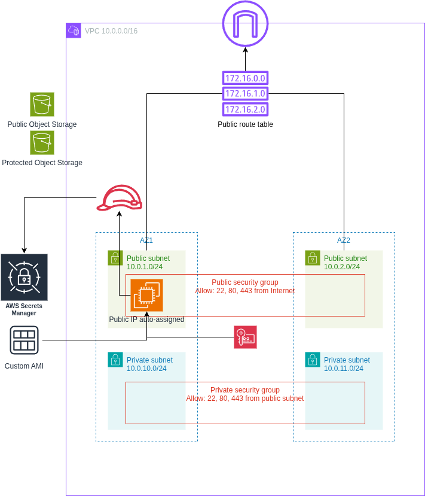
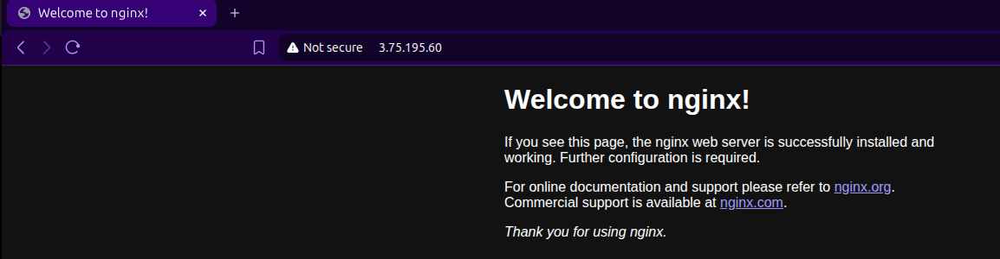
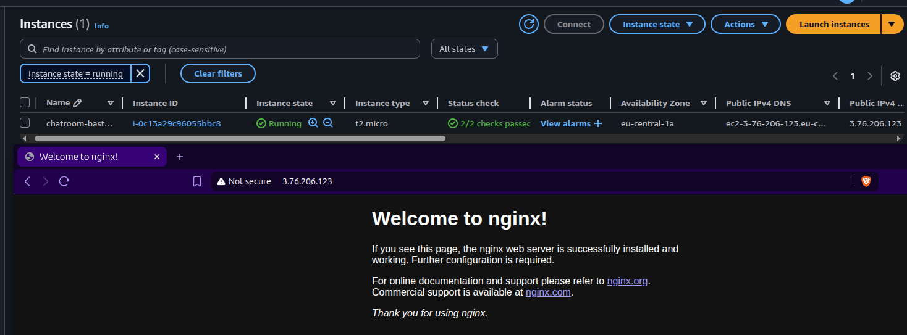

# Cloud Architectures AWS - Task 6 Custom VM image
Task:
> README.md contains instructions how to setup VM that is used to create VM Image.

> Task goals:
> - Find some application that can be tested with http protocol (80, no TLS).
> - Some possible apps: Apache, Nginx, Lighttpd
> - Prepare CLI commands to install application on VM
> - Test public Internet access to prepared VM and include screenshot about passing test to task README.txt
> - Create VM Image when setup is verified to work.
> - Create VM from VM Image
> - Test public Internet access to image based VM and include screenshot about passing test to task README.txt

(Source: https://pekkakorpi-tassi.fi/courses/pkt-arc/pkt-arc-edu-olt-2025-1e/iac_deployment.html)

This documentation will also contain my own documentative process of going through the task

## Task 6 implementation

### Preparing policies
This task handles creation of images, so I added ImageCrud policy to my IAM user.
```json
    {
      "Sid": "ImageCrud",
      "Effect": "Allow",
      "Action": [
        "ec2:CreateImage",
        "ec2:DeregisterImage",
        "ec2:DescribeImages"
      ],
      "Resource": "*"
    }
```

### Changes to Terraform configs
Updated `main.tf` similarly as previous task, so changing task 5 -> 6

Image of the goal infrastructure with custom AMI:



Since for this task we just need to fix a custom VM image. The first task is choosing
an application that will show a default http page when it's up. Let's choose nginx
for this.

First we will spin up the instance as it has been in the previous task.

(Note: I had to change the secret in `secrets.tf` to `chatroom-demo-secret-2`
because it takes a long time for secrets to get removed, apparently.)

Setting up the AWS CLI, SSO, initializing terraform, testing the deployment:
```bash
➜ aws configure sso
# typical login flow, set profile as cloud-architect-task6

➜ terraform init
...
Terraform has been successfully initialized!

➜ terraform plan
# read through the plan and make sure everything looks right!!

➜ terraform apply
...
Apply complete! Resources: 25 added, 0 changed, 0 destroyed.

Outputs:

ami_id = "ami-0e6304d9080b0d13d"
ami_name = "al2023-ami-minimal-2023.9.20251110.1-kernel-6.12-x86_64"
availability_zones = tolist([
  "eu-central-1a",
  "eu-central-1b",
])
bastion_instance_id = "i-05447f91bc9e003ee"
bastion_private_ip = "10.0.1.6"
bastion_public_ip = "3.75.195.60"
internet_gateway_id = "igw-0e2ed83f0de882a20"
private_security_group_id = "sg-0aba3d13d54333c6f"
private_subnet_ids = [
  "subnet-0b7a29b536998af8d",
  "subnet-0ae8570ad0715ec13",
]
protected_bucket_id = "chatroom-protected-storage"
public_bucket_id = "chatroom-public-storage"
public_route_table_id = "rtb-093dcd70e6b3e9b41"
public_security_group_id = "sg-0afbbb0f1bdeffbd8"
public_subnet_ids = [
  "subnet-0ccaca742326653a3",
  "subnet-08a094634289bb087",
]
ssh_command = "ssh -i chatroom-bastion-key.pem ec2-user@3.75.195.60"
ssh_key_name = "chatroom-bastion-key"
ssh_private_key_path = "./chatroom-bastion-key.pem"
vpc_cidr = "10.0.0.0/16"
vpc_id = "vpc-02c33ddd4508979b7"
```

SSH in to the instance with the given command:
```bash
➜ ssh -i chatroom-bastion-key.pem ec2-user@3.75.195.60

# in the AWS EC2 instance
$ sudo yum update -y
$ sudo yum install -y nginx
$ sudo systemctl enable nginx
$ sudo systemctl start nginx
```

Then checking the IP at port 80 in browser:



Next, we create a custom image of the currently running instance. Set profile
environment variable. Could set region too, but I will use it directly in the command.
```bash
➜ export AWS_PROFILE=cloud-architect-task6
➜ aws ec2 create-image --instance-id i-05447f91bc9e003ee --name "task6-custom-vm-image-nginx" --no-reboot --region eu-central-1

# and this was output
{ "ImageId": "ami-06336b3a4ceab53e0" }
```

Next let's use data lookup by the given AMI name so we don't have to copy that ImageId
around.

```terraform
data "aws_ami" "task6_custom_image" {
  most_recent = true
  filter {
    name   = "name"
    values = ["task6-custom-vm-image-nginx"]
  }
  owners = [data.aws_caller_identity.current.account_id]
}
```

Then let's update the bastion AWS instance to use the custom image next time
it's spun up.

```terraform
resource "aws_instance" "bastion" {
  ami                         = data.aws_ami.task6_custom_image.id
  instance_type               = var.instance_type
  subnet_id                   = aws_subnet.public_az1.id
  vpc_security_group_ids      = [aws_security_group.public.id]
  key_name                    = aws_key_pair.bastion.key_name
  associate_public_ip_address = true
  iam_instance_profile        = aws_iam_instance_profile.bastion.name
  tags = merge(local.common_tags, {
    Name = "chatroom-bastion"
  })
}
```

First let's destroy:
```bash
➜ terraform destroy
...
Destroy complete! Resources: 25 destroyed.
```

Then plan + apply again
```bash
➜ terraform plan
...
  # aws_instance.bastion will be created
  + resource "aws_instance" "bastion" {
      + ami         = "ami-06336b3a4ceab53e0" # <- matches what we created
...
```

Again, need to change the secret to `chatroom-demo-secret-3` this time..

```bash
➜ terraform apply
...
bastion_public_ip = "3.76.206.123"
...
```

Let's check the http page again with the given IP.



## Requirements for deployment
- Need access to AWS through AWS CLI. Need also proper permissions.
    - Perms here outlined in `cloud_architect_course_policies.json`
    - I used IAM Identity Center. I already had a user here that is used for
    testing the AWS CLI. I attach the policy to that user, then use the AWS
    CLI for SSO'ing into that user
        - `aws configure sso` -> login, give access to CLI
        - creating a user might be a hassle, might not..
        - NOTE: difference compared to task 1 is that I now have a general permission
        set "cloud_architect_course_policies" that I will just update for each
        task instead of creating new permission sets for each task.
- Once AWS CLI works, make sure `main.tf` is populated (take care of the profile
being correct! It's name is set during SSO), run `terraform init`.
- If init worked. Next run `terraform plan` to see what will be done.
    - Assuming all tf files from my repository is in that directory, the plan
    should show somewhat similar stuff as seen here in the report.
- If happy with the plan, run `terraform apply`.
- Confirm in AWS console

## These are good for multiple tasks when updating permission policies
- to update permission set
    - IAM Identity Center > Permission sets > cloud_architect_course_policies
        - edit inline policy
    - new permission set for user
        - AWS accounts > users and groups > select user > change permission sets
