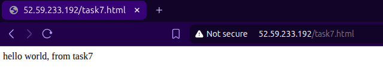
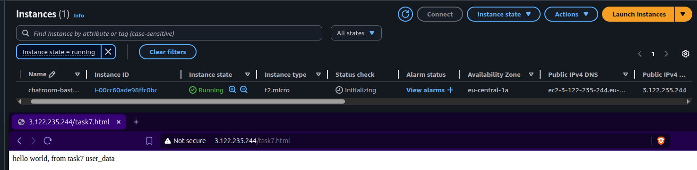

# Cloud Architectures AWS - Task 7 VM provisioning
Task:
> Aim is to take IaC template (or templates) from previous task and expand the configurations.

> Aim is to continue to develop IaC template (or templates) that handles the requirements of this task.

> README.md contains instructions how to setup VM that is used to create VM Image.

> Task goals:
> - Use CLI commands to install application on VM from previous task
> - Update VM creation script, to run app install CLI commands as user data
> - Test public Internet access to VM and include screenshot about passing test to task README.txt

(Source: https://pekkakorpi-tassi.fi/courses/pkt-arc/pkt-arc-edu-olt-2025-1e/iac_deployment.html)

This documentation will also contain my own documentative process of going through the task

## Task 7 implementation

### Preparing policies
Policies don't require changes here, as it's just adding user data to EC2 config.

### Changes to Terraform configs
Updated `main.tf` similarly as previous task, so changing task 6 -> 7

The naming of the demo secret was changed for this task to avoid problems with
secrets manager.

```terraform
resource "aws_secretsmanager_secret" "demo" {
  name = "chatroom-demo-secret-task7-1" # task7-1, task7-2 etc..

  tags = merge(local.common_tags, {
    Name = "chatroom-demo-secret"
  })
}
```

Architecture actually has no changes now, just adding user data to VM creation
after testing manually first that it works.

So let's spin up the EC2 instance as usual with the following flow.

Setting up the AWS CLI, SSO, initializing terraform, testing the deployment:
```bash
➜ aws configure sso
# typical login flow, set profile as cloud-architect-task7

➜ terraform init
...
Terraform has been successfully initialized!

➜ terraform plan
# read through the plan and make sure everything looks right!!

➜ terraform apply
...
ssh_command = "ssh -i chatroom-bastion-key.pem ec2-user@52.59.233.192"
...
```

Use the above ssh command to connect to the instance, let's create a `task7.html`
file that nginx will host.

```bash
➜ ssh -i chatroom-bastion-key.pem ec2-user@52.59.233.192
$ ls /usr/share/nginx/html/
404.html        icons/          nginx-logo.png
50x.html        index.html      poweredby.png
$ echo "hello world, from task7" > task7.html
$ ls
task7.html
$ sudo mv task7.html /usr/share/nginx/html/
```



Now let's automate it with user data field in the `ec2.tf`.

```terraform
resource "aws_instance" "bastion" {
  ami                         = data.aws_ami.task6_custom_image.id
  instance_type               = var.instance_type
  subnet_id                   = aws_subnet.public_az1.id
  vpc_security_group_ids      = [aws_security_group.public.id]
  key_name                    = aws_key_pair.bastion.key_name
  associate_public_ip_address = true
  iam_instance_profile        = aws_iam_instance_profile.bastion.name
  user_data                   = file("${path.module}/user_data.sh") # newest addition
  tags = merge(local.common_tags, {
    Name = "chatroom-bastion"
  })
}
```

And contents of `user_data.sh`, using information gained here and in the previous
task. I add the installation scripts, so this would work on a fresh image as well.

```bash
#!/bin/bash
sudo yum update -y
sudo yum install -y nginx
sudo systemctl enable nginx
sudo systemctl start nginx
echo "hello world, from task7 user_data" > task7.html
sudo mv task7.html /usr/share/nginx/html/task7.html
```

Let's give it a go after changing the secret id to `..task7-2`

```bash
➜ terraform plan
# read through the plan and make sure everything looks right!!

➜ terraform apply
...
Apply complete! Resources: 25 added, 0 changed, 0 destroyed.

Outputs:

ami_id = "ami-0e6304d9080b0d13d"
ami_name = "al2023-ami-minimal-2023.9.20251110.1-kernel-6.12-x86_64"
availability_zones = tolist([
  "eu-central-1a",
  "eu-central-1b",
])
bastion_instance_id = "i-00cc60ade98ffc0bc"
bastion_private_ip = "10.0.1.21"
bastion_public_ip = "3.122.235.244"
internet_gateway_id = "igw-058b104a8477c1a71"
private_security_group_id = "sg-02b7c268b2cf86454"
private_subnet_ids = [
  "subnet-0e0ad0216cd37cbd0",
  "subnet-0ead9448dd493ac14",
]
protected_bucket_id = "chatroom-protected-storage"
public_bucket_id = "chatroom-public-storage"
public_route_table_id = "rtb-0c052e797da1552c1"
public_security_group_id = "sg-0068e346aaa3ac218"
public_subnet_ids = [
  "subnet-09f404fd2e2f298f8",
  "subnet-06bf6d756beba1656",
]
ssh_command = "ssh -i chatroom-bastion-key.pem ec2-user@3.122.235.244"
ssh_key_name = "chatroom-bastion-key"
ssh_private_key_path = "./chatroom-bastion-key.pem"
vpc_cidr = "10.0.0.0/16"
vpc_id = "vpc-0d6f0b2ce6aab7db4"
```

We see the IP in the outputs at `bastion_public_ip`.

And immediately let's go to the address `http://3.122.235.244/task7.html` to see if it's there.



Success!

## Requirements for deployment
- Need access to AWS through AWS CLI. Need also proper permissions.
    - Perms here outlined in `cloud_architect_course_policies.json`
    - I used IAM Identity Center. I already had a user here that is used for
    testing the AWS CLI. I attach the policy to that user, then use the AWS
    CLI for SSO'ing into that user
        - `aws configure sso` -> login, give access to CLI
        - creating a user might be a hassle, might not..
        - NOTE: difference compared to task 1 is that I now have a general permission
        set "cloud_architect_course_policies" that I will just update for each
        task instead of creating new permission sets for each task.
- Once AWS CLI works, make sure `main.tf` is populated (take care of the profile
being correct! It's name is set during SSO), run `terraform init`.
- If init worked. Next run `terraform plan` to see what will be done.
    - Assuming all tf files from my repository is in that directory, the plan
    should show somewhat similar stuff as seen here in the report.
- If happy with the plan, run `terraform apply`.
- Confirm in AWS console

## These are good for multiple tasks when updating permission policies
- to update permission set
    - IAM Identity Center > Permission sets > cloud_architect_course_policies
        - edit inline policy
    - new permission set for user
        - AWS accounts > users and groups > select user > change permission sets
