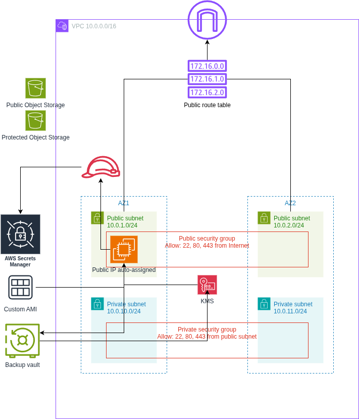
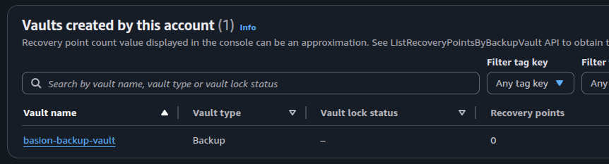
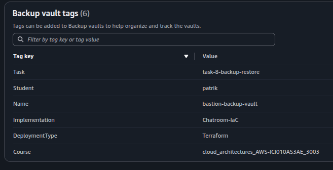
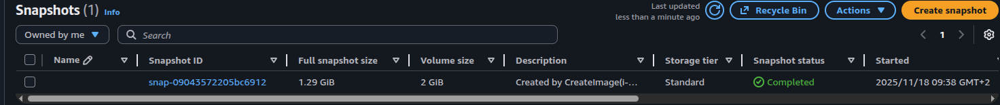

# Cloud Architectures AWS - Task 8 Backup and Restore
Task:
> Aim is to take IaC template (or templates) from previous task and expand the configurations.

> Aim is to continue to develop IaC template (or templates) that handles the requirements of this task.

> README.md contains instructions how to setup VM that is used to create VM Image.

> Task goals:
> - setup VM automated backups and lifecycle rules

(Source: https://pekkakorpi-tassi.fi/courses/pkt-arc/pkt-arc-edu-olt-2025-1e/iac_deployment.html)

This documentation will also contain my own documentative process of going through the task

## Task 8 implementation

### Preparing policies
This took a lot of experimenting again with terraform, as there were quite many
policies that were knit together in ways I didn't think of..

These two made sense, used policysim and slight bit of testing to fill these out
```json
    {
      "Sid": "IamManagedPolicyOps",
      "Effect": "Allow",
      "Action": [
        "iam:AttachRolePolicy",
        "iam:DetachRolePolicy",
        "iam:ListAttachedRolePolicies",
        "iam:ListPolicies",
        "iam:GetPolicy",
        "iam:GetPolicyVersion"
      ],
      "Resource": "*"
    },
    {
      "Sid": "BackupCrud",
      "Effect": "Allow",
      "Action": [
        "backup:CreateBackupVault",
        "backup:DeleteBackupVault",
        "backup:DescribeBackupVault",
        "backup:ListBackupVaults",
        "backup:CreateBackupPlan",
        "backup:UpdateBackupPlan",
        "backup:DeleteBackupPlan",
        "backup:GetBackupPlan",
        "backup:ListBackupPlans",
        "backup:CreateBackupSelection",
        "backup:DeleteBackupSelection",
        "backup:GetBackupSelection",
        "backup:TagResource",
        "backup:UntagResource",
        "backup:ListTags"
      ],
      "Resource": "*"
    },
```

These were more surprising. The PassRole one not that much in hindsight, because
terraform is passing the IAM role to the backup service so that snapshots can be
taken. Again, `ACCOUNT_ID` needs to be replaced with your own when pasting to
permission sets.
```json
    {
      "Sid": "BackupStorageAndKMSForVaults",
      "Effect": "Allow",
      "Action": [
        "backup-storage:*",
        "kms:CreateGrant",
        "kms:DescribeKey",
        "kms:GenerateDataKey*",
        "kms:Encrypt",
        "kms:Decrypt",
        "kms:ReEncrypt*"
      ],
      "Resource": "*"
    },
    {
      "Sid": "IamPassBackupRolesToBackupService",
      "Effect": "Allow",
      "Action": "iam:PassRole",
      "Resource": "arn:aws:iam::${ACCOUNT_ID}:role/bastion-backup-service-role",
      "Condition": {
        "StringEquals": {
          "iam:PassedToService": "backup.amazonaws.com"
        }
      }
    }
```

### Changes to Terraform configs
Image of the goal architecture:



Main source for backup generation into terraform:
- https://registry.terraform.io/providers/hashicorp/aws/latest/docs/resources/backup_plan

Updated `main.tf` similarly as previous task, so changing task 7 -> 8

We will create a `backup.tf` which will be configured as follows

Creating a backup vault is simple
```terraform
resource "aws_backup_vault" "bastion_vault" {
  name = "bastion-backup-vault"
  tags = merge(local.common_tags, {
    Name = "bastion-backup-vault"
  })
}
```

Then an IAM role that will work as the backup service role.
```terraform
resource "aws_iam_role" "backup_service_role" {
  name = "bastion-backup-service-role"
  assume_role_policy = jsonencode({
    Version = "2012-10-17",
    Statement = [
      {
        Effect = "Allow",
        Principal = {
          Service = "backup.amazonaws.com"
        },
        Action = "sts:AssumeRole"
      }
    ]
  })
  tags = merge(local.common_tags, {
    Name = "bastion-backup-service-role"
  })
}
```

The previous role needs a permissions policy. We will attach an AWS managed policy for it,
`AWSBackupServiceRolePolicyForBackup`.

(Source: http://docs.aws.amazon.com/aws-managed-policy/latest/reference/AWSBackupServiceRolePolicyForBackup.html)
```terraform
resource "aws_iam_role_policy_attachment" "backup_service_role_attach" {
  role       = aws_iam_role.backup_service_role.name
  policy_arn = "arn:aws:iam::aws:policy/service-role/AWSBackupServiceRolePolicyForBackup"
}
```

Then we create a backup plan. This will do a daily backup at 01:00 UTC with a 7 day retention
policy. Stored in the `bastion_vault`.

```terraform
resource "aws_backup_plan" "bastion_daily" {
  name = "bastion-daily-backup-plan"
  rule {
    rule_name         = "daily-backup"
    target_vault_name = aws_backup_vault.bastion_vault.name
    schedule          = "cron(0 1 * * ? *)"
    lifecycle {
      delete_after = 7
    }
  }
  tags = merge(local.common_tags, {
    Name = "bastion-daily-backup-plan"
  })
}

resource "aws_backup_selection" "bastion_selection" {
  name         = "bastion-backup-selection"
  iam_role_arn = aws_iam_role.backup_service_role.arn
  plan_id      = aws_backup_plan.bastion_daily.id

  resources = [
    aws_instance.bastion.arn
  ]
}
```

Setting up the AWS CLI, SSO, initializing terraform, testing the deployment:
```bash
➜ aws configure sso
# typical login flow, set profile as cloud-architect-task8

➜ terraform init
...
Terraform has been successfully initialized!

➜ terraform plan
# read through the plan and make sure everything looks right!!

➜ terraform apply
...
aws_backup_selection.bastion_selection: Creating...
aws_backup_selection.bastion_selection: Creation complete after 0s [id=d7e9818e-80fe-456b-9d98-36d43a52001f]
...
```

Then some images from the console showing that the vault is created with tags,
and snapshot was created



Noticed that I typo'd `bastion` here, will be fixed for next deployments



Tags came out fine



And snapshot seems to have been taken instantly as the rule was in place, as it should.

## Requirements for deployment
- Need access to AWS through AWS CLI. Need also proper permissions.
    - Perms here outlined in `cloud_architect_course_policies.json`
    - I used IAM Identity Center. I already had a user here that is used for
    testing the AWS CLI. I attach the policy to that user, then use the AWS
    CLI for SSO'ing into that user
        - `aws configure sso` -> login, give access to CLI
        - creating a user might be a hassle, might not..
        - NOTE: difference compared to task 1 is that I now have a general permission
        set "cloud_architect_course_policies" that I will just update for each
        task instead of creating new permission sets for each task.
- Once AWS CLI works, make sure `main.tf` is populated (take care of the profile
being correct! It's name is set during SSO), run `terraform init`.
- If init worked. Next run `terraform plan` to see what will be done.
    - Assuming all tf files from my repository is in that directory, the plan
    should show somewhat similar stuff as seen here in the report.
- If happy with the plan, run `terraform apply`.
- Confirm in AWS console

## These are good for multiple tasks when updating permission policies
- to update permission set
    - IAM Identity Center > Permission sets > cloud_architect_course_policies
        - edit inline policy
    - new permission set for user
        - AWS accounts > users and groups > select user > change permission sets
