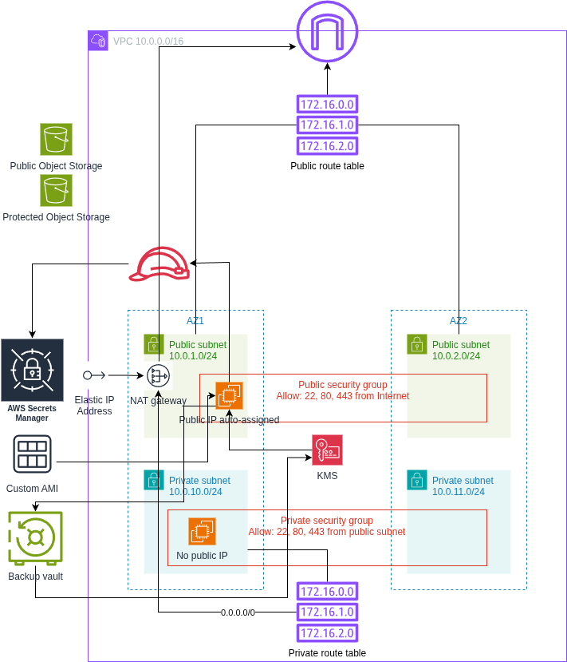
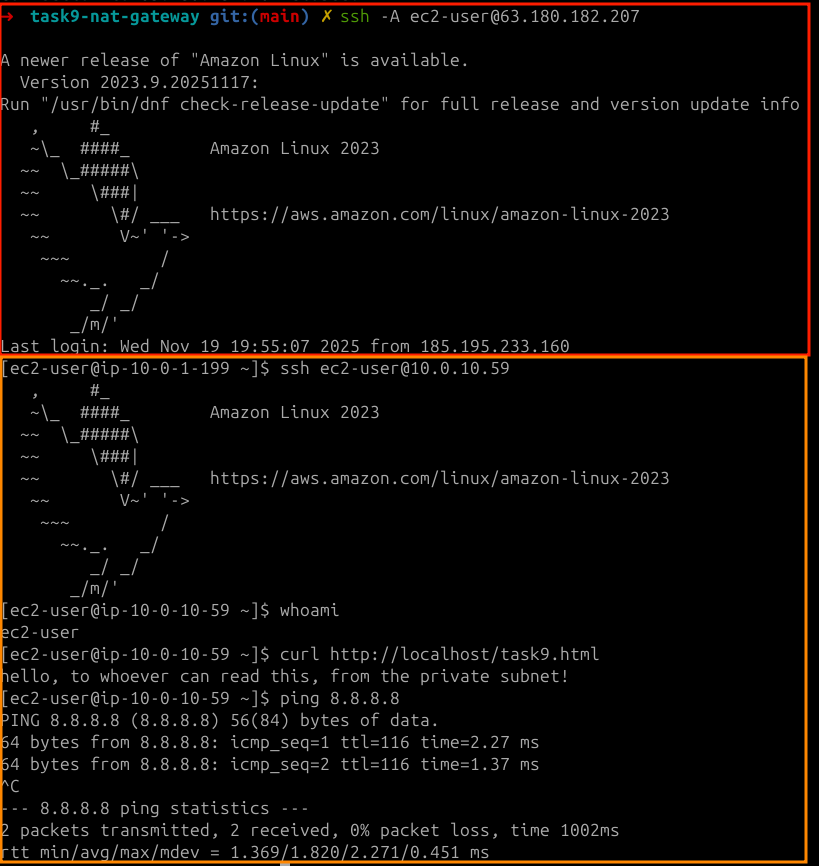
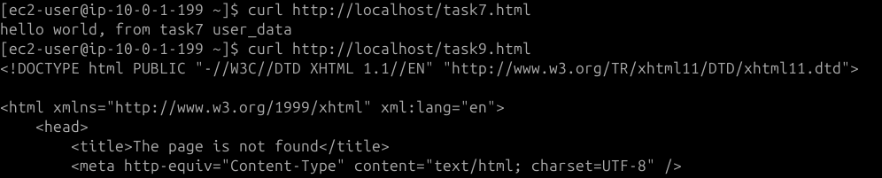

# Cloud Architectures AWS - Task 9 NAT Gateway
Task:
> Aim is to take IaC template (or templates) from previous task and expand the configurations.

> Aim is to continue to develop IaC template (or templates) that handles the requirements of this task.

> README.md contains instructions how to setup VM that is used to create VM Image.

> Task goals:
> - You need to have Public Subnet and Private Subnet
> - Setup NAT Gateway to Public Subnet (Route Tables for Public and Private Subnets are important)
> - Create VM to Private Subnet and run app install CLI commands as user data
> - Application is downloaded from Internet even if VM is in Private Subnet
> - Application install must succeed
> - You need to find a way to access VM in Private Subnet
> - Run cli commands locally on VM in Private Submet to verify install succeeded
> - Include screenshot about succesfull CLI test on VM to README.txt

(Source: https://pekkakorpi-tassi.fi/courses/pkt-arc/pkt-arc-edu-olt-2025-1e/iac_deployment.html)

This documentation will also contain my own documentative process of going through the task

## Task 9 implementation

### Preparing policies
As usual, policysim with a little bit of trial and error from terraform for these
additions to the IAM user policy:
```json
    {
      "Sid": "NatGatewayAndEipCrud",
      "Effect": "Allow",
      "Action": [
        "ec2:AllocateAddress",
        "ec2:ReleaseAddress",
        "ec2:DisassociateAddress",
        "ec2:CreateNatGateway",
        "ec2:DeleteNatGateway",
        "ec2:DescribeAddresses",
        "ec2:DescribeNatGateways"
      ],
      "Resource": "*"
    }
```

### Changes to Terraform configs
Image of the goal architecture:



Changed the typical stuff in `main.tf`, so task 8 -> 9 with task name change.
As well as secret name changed to task9-1.

Private subnets were already created many tasks ago, but were unused.

NAT-gateway needs an EIP, so these additions I did to the `vpc.tf` first.
```terraform
resource "aws_eip" "nat_eip" {
  domain = "vpc"
  tags = merge(local.common_tags, {
    Name = "chatroom-nat-eip"
  })
}

resource "aws_nat_gateway" "nat_gw_az1" {
  allocation_id = aws_eip.nat_eip.id
  subnet_id     = aws_subnet.public_az1.id
  tags = merge(local.common_tags, {
    Name = "chatroom-nat-gateway-az1"
  })
  depends_on = [aws_internet_gateway.main]
}
```

Created private route table
```terraform
resource "aws_route_table" "private" {
  vpc_id = aws_vpc.main.id
  tags = merge(local.common_tags, {
    Name = "chatroom-rt-private"
  })
}
```

Created routes for the NAT-gateway to be used for private routing
```terraform
resource "aws_route" "private_nat_route" {
  route_table_id         = aws_route_table.private.id
  destination_cidr_block = "0.0.0.0/0"
  nat_gateway_id         = aws_nat_gateway.nat_gw_az1.id
}
```

Added also private route table associations
```terraform
resource "aws_route_table_association" "private_az1" {
  subnet_id      = aws_subnet.private_az1.id
  route_table_id = aws_route_table.private.id
}

resource "aws_route_table_association" "private_az2" {
  subnet_id      = aws_subnet.private_az2.id
  route_table_id = aws_route_table.private.id
}
```

Created a separate `user_data_private.sh` to be used for installing nginx and
giving a `task9.html` for it to serve. It's basically a copy of `user_data.sh`.
```bash
#!/bin/bash
sudo yum update -y
sudo yum install -y nginx
sudo systemctl enable nginx
sudo systemctl start nginx
echo "hello, to whoever can read this, from the private subnet!" > task9.html
sudo mv task9.html /usr/share/nginx/html/task9.html
```

Then the update to `ec2.tf`. Make sure `associate_public_ip_address = false` as
it's meant to be private. Spawn the private instance with the amazon AMI instead
of custom one for making sure nginx has to be actually downloaded off the internet.
```terraform
resource "aws_instance" "private_app" {
  ami                         = data.aws_ami.amazon_linux.id
  instance_type               = var.instance_type
  subnet_id                   = aws_subnet.private_az1.id
  vpc_security_group_ids      = [aws_security_group.private.id]
  key_name                    = aws_key_pair.bastion.key_name
  associate_public_ip_address = false
  user_data                   = file("${path.module}/user_data_private.sh")
  tags = merge(local.common_tags, {
    Name = "chatroom-private-app"
  })
}
```

Updated `outputs.tf` as well now, to display more info on the private instance
so I don't have to check in the console.
```terraform
output "private_instance_id" {
  value = aws_instance.private_app.id
}

output "private_instance_private_ip" {
  value = aws_instance.private_app.private_ip
}

output "ssh_to_private_from_bastion" {
  value = "ssh -i ${var.ssh_key_name}.pem ec2-user@${aws_instance.private_app.private_ip}"
}
```

Setting up the AWS CLI, SSO, initializing terraform, testing the deployment:
```bash
➜ aws configure sso
# typical login flow, set profile as cloud-architect-task9

➜ terraform init
...
Terraform has been successfully initialized!

➜ terraform plan
# read through the plan and make sure everything looks right!!

➜ terraform apply
...
Apply complete! Resources: 37 added, 0 changed, 0 destroyed.

Outputs:

ami_id = "ami-02d5a0cdd8fe4a949"
ami_name = "al2023-ami-minimal-2023.9.20251117.1-kernel-6.12-x86_64"
availability_zones = tolist([
  "eu-central-1a",
  "eu-central-1b",
])
bastion_instance_id = "i-08853ee6d3c937962"
bastion_private_ip = "10.0.1.199"
bastion_public_ip = "63.180.182.207"
internet_gateway_id = "igw-02f78784ce995ee05"
private_instance_id = "i-0c39c89db2ff2410e"
private_instance_private_ip = "10.0.10.59"
private_security_group_id = "sg-0fa6933cd80c24e60"
private_subnet_ids = [
  "subnet-00a77f47bae641f3c",
  "subnet-02a35d42689071c00",
]
protected_bucket_id = "chatroom-protected-storage"
public_bucket_id = "chatroom-public-storage"
public_route_table_id = "rtb-0d36aaa9b31ff7f36"
public_security_group_id = "sg-09c4a70e04ed97124"
public_subnet_ids = [
  "subnet-057c84ff2e008405c",
  "subnet-0990dcb95557c0642",
]
ssh_command = "ssh -i chatroom-bastion-key.pem ec2-user@63.180.182.207"
ssh_key_name = "chatroom-bastion-key"
ssh_private_key_path = "./chatroom-bastion-key.pem"
ssh_to_private_from_bastion = "ssh -i chatroom-bastion-key.pem ec2-user@10.0.10.59"
vpc_cidr = "10.0.0.0/16"
vpc_id = "vpc-082af02516834e4ee"
```

I realized here that the SSH commands themselves won't work to get to the private
instance. We also need to make it so that the ssh-agent takes the key with them
to the ssh tunnel. So initially, need to run the following command to start a
new ssh-agent (because mine at least carries too many keys..), then we add the
bastion key to that agent.

```bash
eval "$(ssh-agent -s)"
ssh-add chatroom-bastion-key.pem
```

Now after adding the key, it's no longer needed to supply ssh command with the
input file `-i`-flag, but it is necessary to use the `-A`-flag to make the agent
carry the key to the target machine so we can continue the ssh onward to the
private instance.

Interesting note here: the custom image from task6 is already outdated!
```bash
➜ ssh -A ec2-user@63.180.182.207
A newer release of "Amazon Linux" is available.
...
[ec2-user@ip-10-0-1-199 ~]$ ssh ec2-user@10.0.10.59
...
[ec2-user@ip-10-0-10-59 ~]$ whoami
ec2-user

[ec2-user@ip-10-0-10-59 ~]$ curl http://localhost/task9.html
hello, to whoever can read this, from the private subnet!

[ec2-user@ip-10-0-10-59 ~]$ ping 8.8.8.8
PING 8.8.8.8 (8.8.8.8) 56(84) bytes of data.
64 bytes from 8.8.8.8: icmp_seq=1 ttl=116 time=2.27 ms
...
```

Same in screenshot form:



Also of course this content is visible from the public subnet EC2 instance too..

This is done from the instance in the public subnet, showing content on it from
task7, and then showing that it does not have task9 in it, then showing that there
is content at task9.html on the private subnet instance:
```bash
[ec2-user@ip-10-0-1-199 ~]$ curl http://localhost/task7.html
hello world, from task7 user_data

[ec2-user@ip-10-0-1-199 ~]$ curl http://localhost/task9.html
... # long nginx 404 page print out
        <title>The page is not found</title>
...

[ec2-user@ip-10-0-1-199 ~]$ curl http://10.0.10.59/task9.html
hello, to whoever can read this, from the private subnet!
```

And same in screenshots



(cut off..)


## Requirements for deployment
- Need access to AWS through AWS CLI. Need also proper permissions.
    - Perms here outlined in `cloud_architect_course_policies.json`
    - I used IAM Identity Center. I already had a user here that is used for
    testing the AWS CLI. I attach the policy to that user, then use the AWS
    CLI for SSO'ing into that user
        - `aws configure sso` -> login, give access to CLI
        - creating a user might be a hassle, might not..
        - NOTE: difference compared to task 1 is that I now have a general permission
        set "cloud_architect_course_policies" that I will just update for each
        task instead of creating new permission sets for each task.
- Once AWS CLI works, make sure `main.tf` is populated (take care of the profile
being correct! It's name is set during SSO), run `terraform init`.
- If init worked. Next run `terraform plan` to see what will be done.
    - Assuming all tf files from my repository is in that directory, the plan
    should show somewhat similar stuff as seen here in the report.
- If happy with the plan, run `terraform apply`.
- Confirm in AWS console

## These are good for multiple tasks when updating permission policies
- to update permission set
    - IAM Identity Center > Permission sets > cloud_architect_course_policies
        - edit inline policy
    - new permission set for user
        - AWS accounts > users and groups > select user > change permission sets
